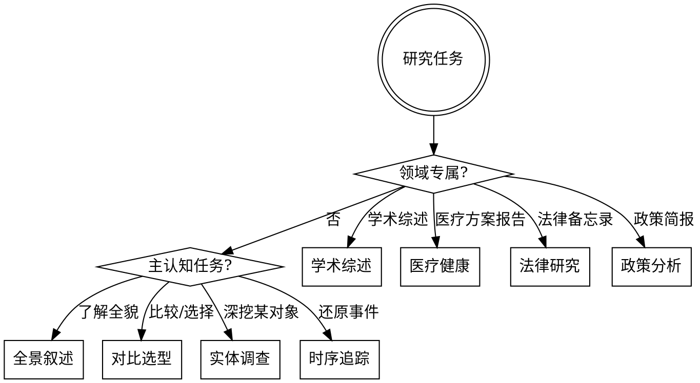

# research-report（研究报告结构模板）

报告结构的决定因素是**读者需要完成的认知任务**，不是研究的信息领域。同一批信息，为做决策而读和为建立全貌而读，需要完全不同的组织方式。

## 模板选择



**领域专属触发条件**：最终产出是学术综述、医疗方案报告、法律备忘录或政策简报，且读者对该类文档有强烈格式预期。商业/投资场景下涉及医疗或法律内容，优先按认知任务选模板，再叠加领域术语惯例。

**复合意图处理**：主意图决定整体框架，次意图压缩为一个章节。例如"先了解行业再评估某公司"→主意图是实体调查（论点驱动式），全景内容压缩为"行业背景"章节，不重复建立完整全景框架。

---

## 基础结构一：全景叙述型

**适用**：行业研究、可行性研究、技术趋势综述  
**读者认知任务**：建立对一个空间的完整心智地图

| 章节 | 必须/可选 | 说明 |
|------|-----------|------|
| 摘要 | 必须 | 3-5 句，含关键结论和核心数据点 |
| 背景与现状 | 必须 | 界定研究范围，说明当前格局和发展阶段 |
| [核心维度 1-N] | 必须 | 按研究维度逐一展开，每维度自成小节 |
| 综合分析 | 必须 | 跨维度关联与洞察，不是各维度摘要 |
| 结论与展望 | 必须 | 基于证据的结论，标注确定性程度 |
| 附录 | 可选 | 数据表格、方法说明 |

**可行性研究变体**：在"综合分析"前插入"财务测算"章节，"结论与展望"改为"可行性判断（Go / No-Go / 有条件 Go）"，明确列出判断依据和关键假设。

---

## 基础结构二：对比选型型

**适用**：竞品分析、技术选型、消费决策  
**读者认知任务**：在多个选项中做出有据可查的决策

| 章节 | 必须/可选 | 说明 |
|------|-----------|------|
| 摘要与推荐 | 必须 | 直接给出推荐结论，一句话说明核心理由 |
| 评估背景 | 必须 | 需求场景、约束条件、评估维度定义及权重 |
| 选项概览 | 必须 | 各选项简介，说明各自定位 |
| **对比矩阵** | 必须 | 表格：行=评估维度，列=各选项，必须有 |
| 逐维度分析 | 必须 | 矩阵无法承载的定性分析，按维度逐一展开 |
| 综合建议 | 必须 | 针对不同场景/需求的差异化建议 |
| 风险与局限 | 可选 | 推荐选项的已知缺陷，便于读者预判 |

**子类差异：**

| 子类 | 特有章节或要求 |
|------|--------------|
| 竞品分析 | 评估背景加"市场格局"（各选项市占/定位）；建议部分增加战略含义 |
| 技术选型 | 对比矩阵加"迁移成本/实施风险"行；建议部分输出 ADR（架构决策记录）格式 |
| 消费决策 | 省略战略维度；建议部分针对用户具体使用场景个性化 |

---

## 基础结构三：实体调查型

**适用**：尽职调查、投资研究、人物/机构背景调查  
**读者认知任务**：全面了解某一对象，形成综合判断

根据研究目的选择三种子结构之一：

### 3a. 系统清单式（尽职调查）

| 章节 | 说明 |
|------|------|
| 执行摘要 | 重大发现 + 关键风险 + 综合建议，可独立阅读 |
| 业务与运营审查 | 商业模式、收入结构、运营状况 |
| 财务审查 | 报表分析、现金流、债务结构 |
| 法律审查 | 合规状态、合同、潜在诉讼 |
| 团队审查 | 核心成员背景、激励结构、稳定性 |
| 重大发现汇总 | 红旗事项（Red Flags）逐条列出，标注严重程度 |
| 建议 | 交易条件建议，或中止依据 |

### 3b. 论点驱动式（投资研究）

| 章节 | 说明 |
|------|------|
| 投资评级与核心逻辑 | 评级（Buy/Hold/Sell）+ 3条核心投资逻辑 |
| 公司与行业概况 | 业务描述、市场定位、竞争格局 |
| 财务分析 | 历史表现、关键指标趋势、质量判断 |
| 估值分析 | 估值方法、目标价区间、敏感性分析 |
| 风险因素 | 下行风险逐条列出，标注影响程度和发生概率 |
| 投资建议 | 建议时间窗口和仓位逻辑 |

### 3c. 叙事式（人物/机构背景调查）

| 章节 | 说明 |
|------|------|
| 基本信息 | 身份、角色、核心标签 |
| 经历与成就 | 时间线叙述，重点事件加粗 |
| 关联网络 | 关键关系、合作伙伴、组织归属 |
| 争议与风险点 | 已知负面信息，标注来源可靠性 |
| 综合评价 | 结合上述信息的综合判断，标注确定性 |

---

## 基础结构四：时序追踪型

**适用**：热点事件、危机追踪、政策/监管变化历程  
**读者认知任务**：还原事件全貌，理解影响与走向

| 章节 | 必须/可选 | 说明 |
|------|-----------|------|
| 摘要 | 必须 | 事件一句话定性 + 当前状态 |
| **事件时间线** | 必须 | 表格：时间 / 事件 / 关键行动方，必须有 |
| 各方立场 | 必须 | 主要利益相关方各自立场，分列不混叙 |
| 影响分析 | 必须 | 已发生的影响分类列出，标注影响程度 |
| 后续走向 | 必须 | 待观察的关键节点和不同情景下的走向 |
| 信源说明 | 可选 | 争议性事实的信息来源可靠性说明 |

---

## 领域专属模板

### 学术综述

```
摘要（Abstract）
引言（研究背景、综述范围、本文结构）
研究脉络（按时间线或流派划分的文献梳理）
方法论对比（不同研究方法的优劣分析）
核心发现综合（跨文献的共识与争议）
研究空白与展望
结论
参考文献（学术引用格式）
```

**特殊要求**：每条关键结论必须指向具体文献；争议点必须呈现各方代表性文献；不得给出文献中未明确支持的结论。

---

### 医疗健康

```
结构化摘要（背景 / 目的 / 方法 / 结果 / 结论）
疾病或干预概述
证据综述（分级呈现）
  - A级：RCT 或系统综述支撑
  - B级：队列研究或权威指南
  - C级：专家意见或病例报告
临床应用建议
特殊人群注意事项（老人/儿童/妊娠/合并症）
局限性与不确定性
参考文献
```

**特殊要求**：所有建议必须标注证据等级（A/B/C）；涉及药物须注明适应症和禁忌症；不确定内容须明确标注，不得暗示确定性。

---

### 法律研究

遵循 IRAC 框架：

```
法律问题（Issue）：清晰陈述待回答的法律问题
适用法规（Rule）：相关法律条文、司法解释、判例
法律分析（Analysis）：将事实套入法规，逐条展开
结论（Conclusion）：明确的法律意见，标注确定性程度
附录（可选）：相关条文全文、参考判例摘要
```

**特殊要求**：明确标注司法管辖区；引用法规注明版本和生效日期；不确定性须明确说明，不得给出超出证据的确定性意见。

---

### 政策分析

```
执行摘要（政策核心 + 主要建议，须可独立阅读）
政策背景（问题界定、现状、历史沿革）
政策内容解析（核心条款、目标、实施机制）
影响评估（受影响群体、经济/社会影响、国际比较）
利益相关方分析（各方立场与博弈）
建议（针对目标受众的具体行动建议）
参考依据
```

**特殊要求**：执行摘要须可独立阅读；建议部分针对不同受众（企业/政府/个人）差异化呈现。

---

## 微观格式规则

宏观结构确定后，每个信息块的格式按信息类型独立决定：

| 信息类型 | 应使用的格式 | 禁止 |
|---------|------------|------|
| 多对象多属性对比 | **表格**（强制） | 分段落逐一描述 |
| 时间序列事件 | 时间线表格或有序列表 | 散文叙述混排 |
| 有序步骤/流程 | 有序列表（1. 2. 3.） | 无序列表或段落 |
| 并列要点（≤5条） | 无序列表 | 长段堆砌 |
| 因果推导/复杂分析 | **段落叙述** | 强行拆成 bullet |
| 关键数字/指标 | 加粗或表格 | 埋入段落中间 |
| 证据等级/评级 | 标签标注（A级 / 🔴 / Buy） | 仅用文字描述 |

---

## 执行纪律

**必须做到：**
- 摘要必须可独立阅读，读者无需看完全文即可获得核心结论
- 对比选型型必须输出对比矩阵表格，不接受纯文字的并列描述各选项
- 所有结论标注确定性程度（"已确认" / "可能" / "存在争议"）
- 复合意图下，次意图内容压缩为一个章节，不重复建立完整框架
- 领域专属模板下，严格遵循对应格式惯例，不混入其他结构

**禁止：**
- 对所有场景使用同一套通用结构，必须选择上述模板之一
- 把对比矩阵拆成多段文字分别描述各选项
- 结论部分只做信息罗列，不给判断
- 同一事实在多个章节重复出现
- 为凑篇幅在摘要中复述正文，或在结论中复述摘要
