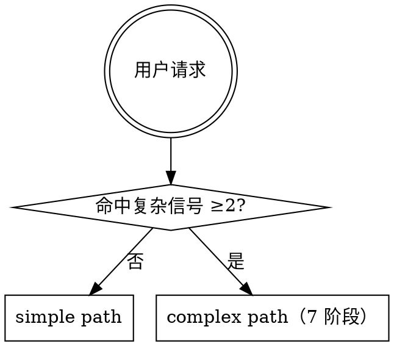
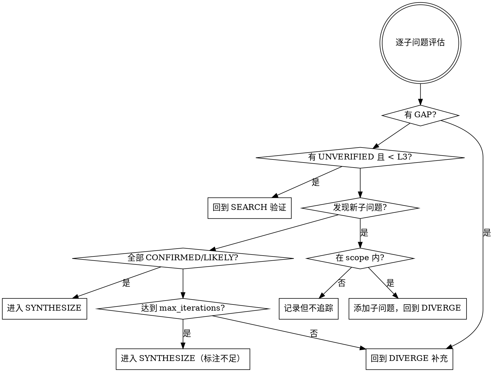

# research-union（迭代式 Deep Research 编排）

核心理念：不是"搜一轮就写报告"，而是 **搜 → 读 → 评估 → 不够就再搜**，循环多轮直到证据充分。

## 路径选择



**复杂信号**（命中任意 2 条进入 complex path）：
- 需要回答多个子问题
- 需要多来源交叉验证
- 涉及竞品对比、方案比较、趋势梳理、事实核验
- 用户明确要求深入调研
- 需要明确时间/地域/样本边界

**simple path**：直接搜索 → 先结论后依据 → 完成。不走 planning，不落盘。

---

## complex path：7 阶段迭代架构

```
PLAN → DIVERGE → SEARCH → TRIAGE → READ → REASSESS → SYNTHESIZE
                    ↑                          |
                    └── 覆盖度不足时回到这里 ───┘
```

### 1. PLAN（研究规划 + 用户确认）

先做探索性搜索：确认术语准确性、判断信息可获取性、校准研究范围。

产出 planning JSON（写入 `research/plan.json`），核心字段：

| 字段 | 说明 | 默认值 |
|------|------|--------|
| topic / goal | 研究主题和核心目标 | — |
| scope | time_range, region, language, inclusions, exclusions | 近3年/全球/zh+en |
| questions[] | 子问题列表，含 evidence_types 和 dimensions | — |
| search_budget | min_queries / max_queries / max_iterations / min_sources_per_question | 15 / 40 / 3 / 2 |
| success_criteria | min_total_sources / min_verified_claims / coverage_target | 8 / 5 / 0.8 |
| source_plan | primary: serper_search + fetch_url; supplement: union-search-skill（仅主链不足时） | — |

向用户展示时用简洁中文概括，只确认：范围、子问题、边界条件。确认后再进入下一阶段。

### 2. DIVERGE（发散式 Query 生成）

对每个子问题生成多维度 query 矩阵（不是直接把子问题当搜索词）：

1. **直接查询**：自然语言表述
2. **专业术语版**：领域专业词汇重新表述
3. **反面查询**：`"X 的问题"` `"X 的缺点"` `"X alternatives"`
4. **对比查询**：`"X vs Y"` `"X compared to Y"`
5. **实体扩展**：通过已知实体做一跳关联搜索
6. **聚合器查询**：目录、排行榜、awesome-list 等聚合页面

目标：每个子问题 3-5 个变体，整体 ≥ `min_queries`。多语言 scope 时生成双语 query。

记录到 `research/queries.json`。

### 3. SEARCH（并发搜索）

尽可能并发执行所有 query（利用 tool_calls 并发能力）。超过单次并发上限时分 2-3 批，每批打满。

搜索源优先级：`serper_search`（主链） > 内置搜索工具（brave/tavily 等） > `union-search-skill`（仅主链不足时）

本阶段目标：收集候选 URL 和摘要，不做深度阅读。

### 4. TRIAGE（结果筛选与去重）

| 规则 | 说明 |
|------|------|
| 去重 | URL 去重 + 镜像/转载去重（保留原始来源） |
| 域名限制 | 同一域名最多 3 条 |
| 视角多样性 | 覆盖支持方、反对方、中立方 |
| 可信度分级 | L1 官方/一手 → L2 权威媒体/peer-reviewed → L3 行业博客/技术社区 → L4 一般媒体/聚合站 → L5 论坛/社交媒体 |
| 相关性评分 | 与子问题匹配度：高/中/低 |
| 时效性排序 | 同等相关性和可信度下，优先选择发布时间更近的来源；超过用户指定 time_range 的来源降为辅助参考 |

产出：按子问题分组的优先阅读列表，每个子问题 top 3-5 个高价值 URL。

### 5. READ（深度阅读与证据提取）

小批量抓取（每批 2-3 个 URL，用 `fetch_url`），避免超时扩散。

对每个页面提取：关键事实和数据、直接引用（带原文）、发布时间和作者、页面中的有价值链接（可选一跳跟踪）。

证据记录格式：`子问题ID | 证据摘要 | 原文引用 | 来源URL | 可信度等级 | 是否需要交叉验证`

抓取失败标记 FAILED，在 REASSESS 阶段考虑补充。

### 6. REASSESS（覆盖度评估 + 迭代决策）

**这是核心阶段。** 对每个子问题逐一评估：来源充分性、证据强度（L1-L2 支撑）、交叉验证（2+ 独立来源）、视角覆盖、新发现。

对每条关键结论标注验证状态：

- **CONFIRMED**：2+ 独立来源交叉确认
- **LIKELY**：1 个可靠来源，无矛盾
- **DISPUTED**：来源间存在矛盾
- **UNVERIFIED**：仅低可信度或单一来源
- **GAP**：缺乏有效证据



**迭代约束**：最多 `max_iterations` 轮（默认 3），补充 query 递减（第2轮 ≤10，第3轮 ≤5），连续 2 轮无新信息则提前终止。

**需要用户确认的情况**：研究范围需明显扩大、需启用 union-search-skill、发现前提假设可能有误。

### 7. SYNTHESIZE（综合报告）

报告必须包含以下 6 个部分：

1. **结论摘要** — 3-5 句回答核心问题，标注整体置信度（高/中/低）
2. **关键发现** — 按子问题组织，每条附 `[CONFIRMED]` `[LIKELY]` `[DISPUTED]` `[UNVERIFIED]` 标签
3. **证据与来源** — 每条结论附来源链接和可信度等级（L1-L5）
4. **分歧与不确定点** — 矛盾信息列出各方观点，DISPUTED 结论说明分歧原因
5. **研究限制** — 未覆盖的子问题、搜索受限领域、建议后续方向
6. **来源清单** — 格式：`[编号] 标题 | URL | 可信度等级 | 访问时间`

同时生成结构化 `research/report_meta.json` 供后续处理。

---

## 与 union-search-skill 的衔接

定位：补充来源，不是默认主链。

启用条件（至少一条）：REASSESS 发现主链覆盖不足（某子问题 0 有效来源）、用户在 PLAN 阶段明确要求、主链对特定领域覆盖差（中文社区、视频平台等）。

启用顺序：先 `preferred` 来源 → 必要时升级到 `all`。补充搜索失败不阻塞研究，在报告中说明限制即可。

---

## 执行纪律

**必须做到：**
- SEARCH 阶段至少并发 5+ 个 query
- REASSESS 必须逐子问题评估，不能笼统说"差不多够了"
- CONFIRMED 必须有 2+ 独立来源交叉确认
- 每轮循环结束后输出覆盖度状态
- 迭代决策基于具体的 GAP/UNVERIFIED 标记

**禁止：**
- 简单问题强行走复杂流程
- PLAN 未确认就大规模搜索
- union-search-skill 当默认主链
- 编造来源或伪造引用
- "搜索到"等同于"已验证"
- 省略关键结论的来源链接
- REASSESS 跳过迭代检查直接 SYNTHESIZE
- 单次搜索后声称"覆盖充分"

**进度透明：** 每个阶段转换时报告当前进度（已搜 query 数 / 已读页面数 / 已确认证据数）和下一步计划。
