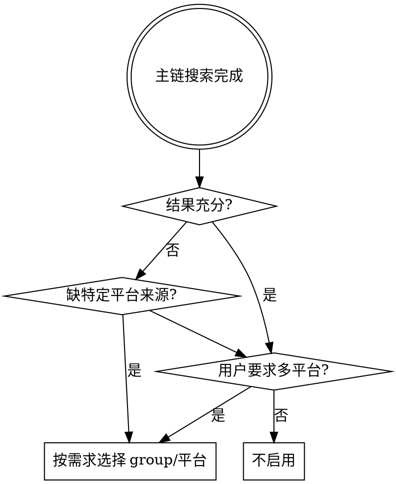

# union-search-plus（补充搜索执行）

内置搜索 API（serper_search、brave_search、tavily_search）是主链。本 skill 是补充链，在主链结果不足时按需选择来源扩大覆盖面。

## 何时启用



典型触发场景：
- 主链返回结果少于 3 条有效来源
- 需要中文社区（小红书、知乎、B站）、开发者平台（GitHub）、社交媒体（Twitter、Reddit）等特定来源
- 用户明确要求"全网搜索""多平台搜索""扩大搜索范围"
- `research-union` 在 REASSESS 阶段判定覆盖不足

## 来源选择（核心）

根据需求精准选择 group 或指定平台，不要无脑走 preferred → all：

| Group | 包含平台 | 适用场景 |
|-------|----------|----------|
| dev | github, reddit | 技术问题、开源项目、开发者讨论 |
| social | douyin, bilibili, youtube, twitter, weibo, zhihu, xiaoyuzhoufm | 舆情分析、用户口碑、视频内容、社交媒体讨论 |
| search | google, tavily, jina, duckduckgo, brave, yahoo, yandex, bing, wikipedia, metaso, volcengine, baidu | 通用搜索引擎补充（主链已覆盖部分，按需补漏） |
| no_api_key | 17 个直接抓取的搜索引擎（baidu_direct, bing_cn_direct, google_direct 等） | 无 API key 时的降级方案 |
| preferred | google, duckduckgo, brave, wikipedia, metaso, tavily, baidu | 快速补洞，低成本高稳定 |
| all | 除小红书外全部平台 | 最大覆盖面，耗时长噪声高，仅在其他 group 不足时使用 |

也可以用 `--platforms` 指定具体平台，比如 `--platforms zhihu bilibili github`。

**选择原则：**
- 查技术/代码/开源 → `--group dev`
- 查社交媒体/舆情/口碑 → `--group social`
- 查中文社区内容 → `--platforms zhihu bilibili weibo`
- 主链搜索引擎结果不够 → `--group preferred`
- 没有 API key → `--group no_api_key`
- 以上都不够 → `--group all`（最后手段）

## 执行流程

0. **先做自检** — 先确认依赖、`.env` 和可用平台，再决定是否真的执行搜索
1. **评估主链结果**（可选）— 用 `assess_coverage.py` 判断是否需要补充
2. **按需求选择 group 或平台** — 精准匹配，不要默认全量
3. **执行搜索** — 调用 `union_search_plus.py`
4. **合并去重** — 用 `merge_search_results.py` 将主链 + 补充结果统一去重重排
5. **返回结果** — 说明覆盖范围和失败平台

## 运行前提

- 从当前工作目录先确认依赖和环境变量，不要跳过自检
- `union_search_plus.py --env-file <path>` 中的相对路径按**当前执行目录**解析；如果不传，会优先尝试当前目录下的 `.env`
- `doctor` 若提示缺少 `python-dotenv` 等依赖，先安装 `scripts/requirements.txt` 中的基础依赖，再执行搜索
- 真实搜索依赖网络；部分平台还依赖 API key 或 Cookie。首次不要直接拿 `all` 做烟测

基础自检：
```bash
python3 .sensenova-claw/skills/union-search-plus/vendor/union-search-skill/union_search_cli.py \
  list --type groups --format json
```

依赖/凭据检查：
```bash
python3 .sensenova-claw/skills/union-search-plus/vendor/union-search-skill/union_search_cli.py \
  doctor --env-file .env
```

## 可调用脚本

低风险烟测（先验证单平台链路，不要一上来跑多平台）：
```bash
python3 .sensenova-claw/skills/union-search-plus/scripts/union_search_plus.py \
  "查询词" --platforms github --limit 3 --timeout 30 --env-file .env
```

统一搜索入口（按 group）：
```bash
python3 .sensenova-claw/skills/union-search-plus/scripts/union_search_plus.py \
  "查询词" --group dev --limit 5 --timeout 60 --env-file .env
```

统一搜索入口（指定平台）：
```bash
python3 .sensenova-claw/skills/union-search-plus/scripts/union_search_plus.py \
  "查询词" --platforms zhihu bilibili github --limit 5 --timeout 60 --env-file .env
```

覆盖度评估（判断主链是否不足）：
```bash
python3 .sensenova-claw/skills/union-search-plus/scripts/assess_coverage.py \
  --input /tmp/primary_results.json --query "查询词" \
  --min-sources 3 --min-topic-coverage 0.45 --min-valid-evidence 6
```

结果合并（主链 + 补充去重重排）：
```bash
python3 .sensenova-claw/skills/union-search-plus/scripts/merge_search_results.py \
  --primary /tmp/primary_results.json --supplement /tmp/union_results.json \
  --query "查询词" --output /tmp/merged_results.json
```

## 执行纪律

- 第一次执行前，先跑 `list` 和 `doctor`
- 按需求选择最精准的 group/平台，不要默认 all
- 单平台烟测通过后，再扩大到 group；不要直接用 `dev/social/all` 判断脚本“坏了”
- 平台失败 ≠ 搜索失败，保留成功平台结果，说明哪些失败
- 不要把搜索结果当已验证事实
- 不要在单点事实问题上走多平台大范围搜索
- 主链已满足阈值时不触发补充
- 完整调研流程由 `research-union` 编排，本 skill 只负责搜索执行

详细故障排查见 `references/troubleshooting.md`，速率控制见 `references/rate_limits.md`。
