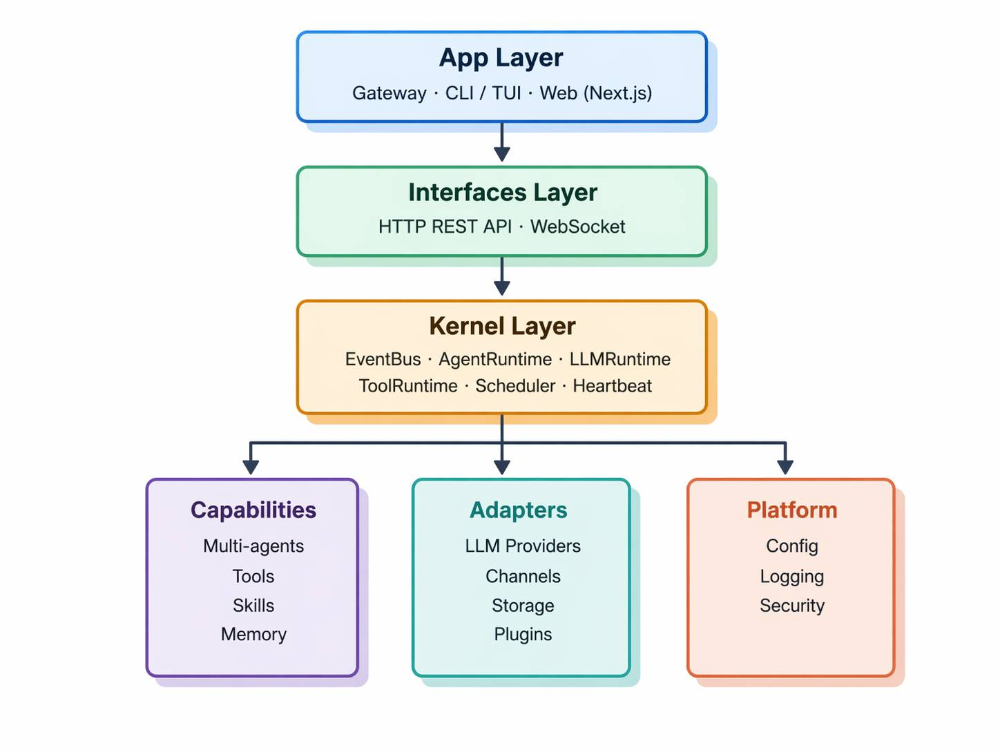
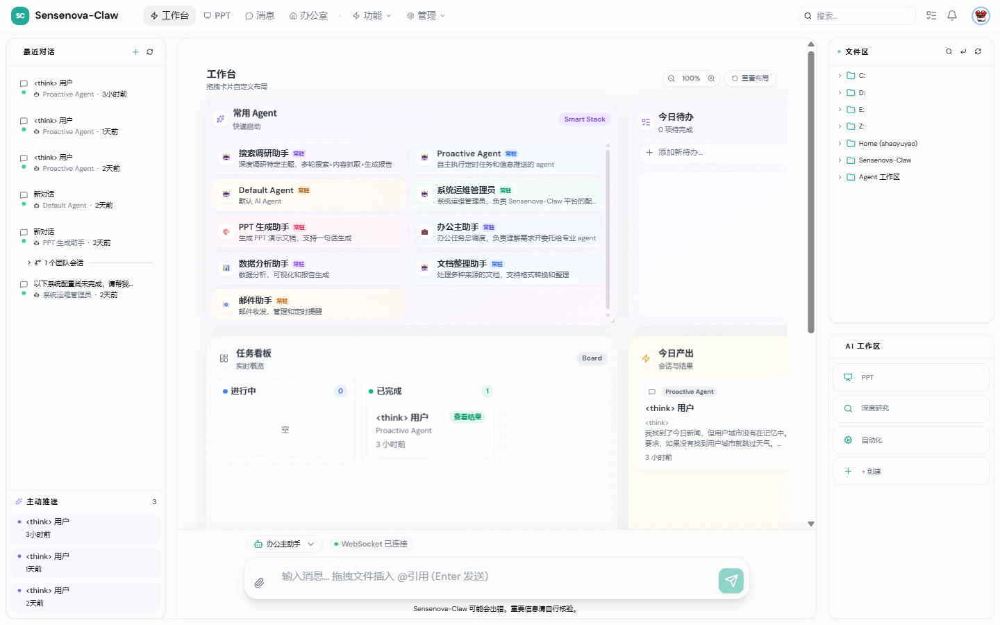
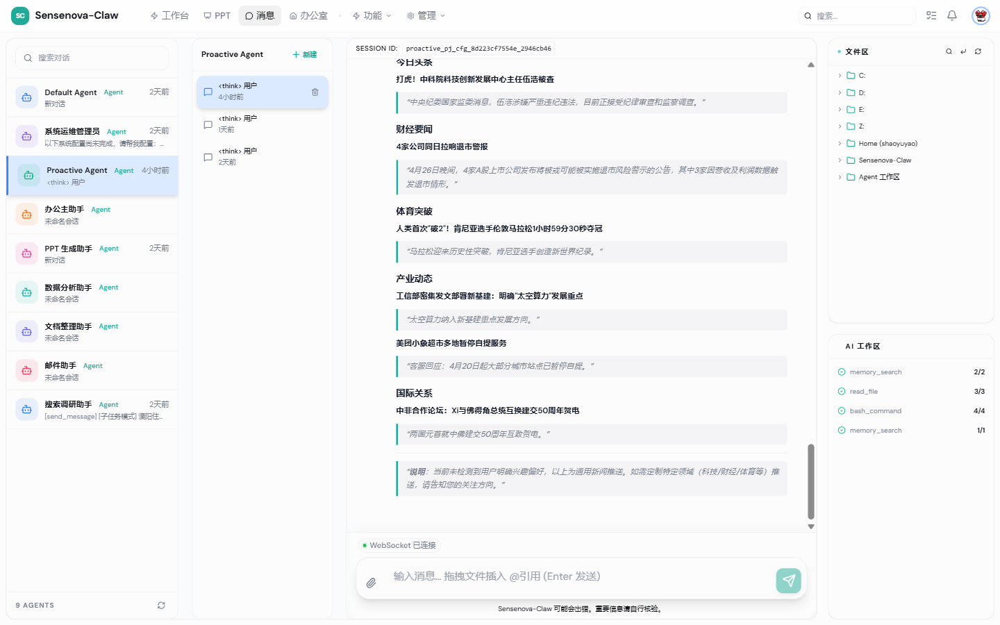
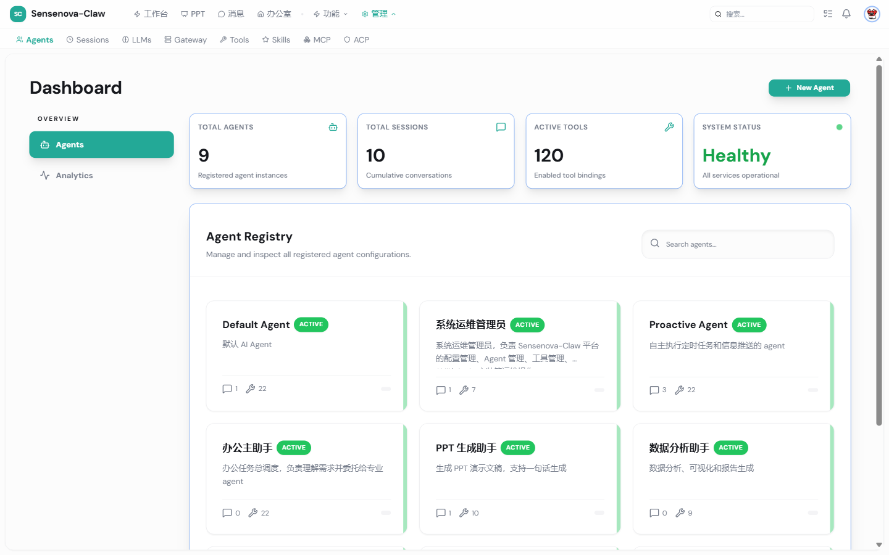
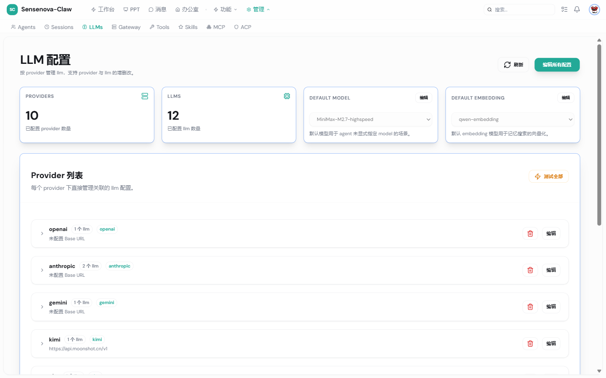
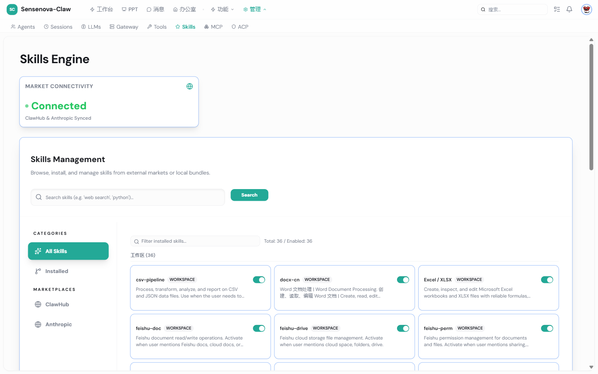
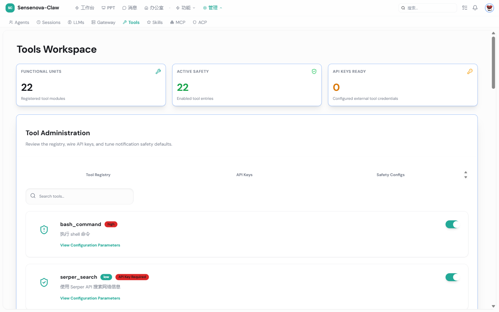
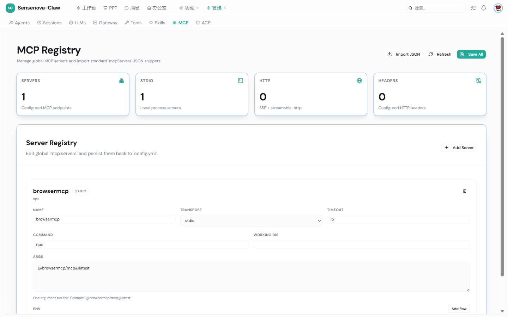
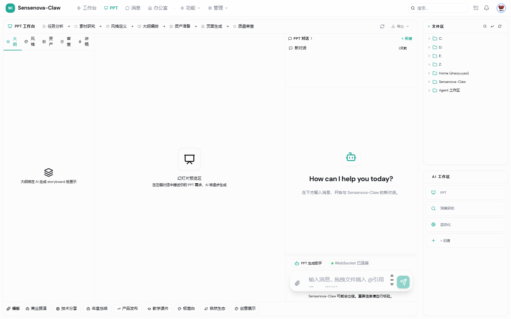

<div align="center">
  <table><tr><td>
    
  </td><td>
    <h1>Sensenova-Claw</h1>
    <strong>基于事件驱动架构的 AI Agent 平台</strong>
  </td></tr></table>
  <p>
    
    
    
    
  </p>
  <p>
    一键安装 · 多 LLM Provider · 多 Agent 编排 · MCP 集成 · Skills 市场 · 记忆系统 · 定时任务<br/>
    内置 Web Dashboard / CLI / TUI · 集成飞书 / 钉钉 / 企微 / Telegram / Discord / QQ / WhatsApp
  </p>
</div>

## Key Features

- **一键安装** — Linux/macOS/Windows 一行命令，自动安装 Python/Node.js/Git，注册全局命令，开箱即用
- **事件驱动架构** — 所有模块通过 PublicEventBus 解耦通信，支持会话级隔离与全链路追踪
- **多 Provider 支持** — OpenAI / Anthropic / Gemini / DeepSeek / Kimi / 智谱 / Minimax / Qwen / Step / 自定义，一键切换
- **预置 9 个 Agent** — Office 调度、PPT 专家、数据分析、文档整理、邮件助手、调研搜索、定时主动推送、系统管理员、默认 Agent
- **多 Agent 编排** — 动态创建/配置子 Agent，支持 Agent-to-Agent 消息委托、配置继承与白名单约束
- **MCP 集成** — 接入外部 MCP Server（stdio/sse/streamable-http），按 Agent 细粒度控制 server / tool 可见性
- **Skills 市场** — 声明式任务编排，预置 37 个 Skills（PPT 流水线、文档转换、调研、Feishu、可视化、数据处理等），支持从 ClawHub 安装/更新
- **Web Dashboard** — Next.js 14 全功能管理界面：对话、Agent、LLM、Skills、Tools、MCP、Cron、会话、自动化监控、PPT 工作台
- **多渠道接入** — Web / CLI / TUI / 飞书 / 钉钉 / 企微 / Telegram / Discord / QQ / WhatsApp，统一 Gateway 架构
- **工具系统** — 内置 24+ 工具（bash / 多源搜索 / 文件读写编辑 / 网页抓取 / 邮件 / Obsidian / 记忆搜索 / Agent 协作），支持权限管理与路径安全
- **记忆系统** — 向量检索 + 文本搜索混合模式，跨会话持久记忆，支持 Turn 级 + 合并压缩
- **定时任务** — Cron / 间隔 / 一次性任务 + 心跳巡检 + 自动化监控面板
- **OpenShell 沙箱** — 一键启动隔离沙箱，无需本地环境
- **配置热更新** — ConfigManager 监听文件变更，事件驱动通知下游模块自动刷新

## 🏗️ Architecture



**核心模块**:

| 层级 | 模块 | 职责 |
|------|------|------|
| **Kernel** | EventBus, Runtime, Scheduler, Heartbeat | 事件通信、运行时编排、定时调度 |
| **Capabilities** | Agents, Tools, Skills, Memory | 多 Agent、工具执行、技能编排、记忆 |
| **Adapters** | LLM, Channels, Storage, Plugins | LLM 对接、渠道适配、持久化、插件 |
| **Interfaces** | HTTP API, WebSocket | REST 接口、WebSocket 实时通信 |
| **Platform** | Config, Logging, Security | 配置管理、日志、路径安全策略 |
| **App** | Gateway, CLI, Web | 应用入口、命令行、前端 |

## Table of Contents

- [Key Features](#key-features)
- [Architecture](#️-architecture)
- [Install](#-install)
- [Quick Start](#-quick-start)
- [Web Dashboard](#-web-dashboard)
- [Configuration](#️-configuration)
- [Built-in Agents](#-built-in-agents)
- [Chat Channels](#-chat-channels)
- [LLM Providers](#-llm-providers)
- [MCP](#-mcp)
- [Tools](#-tools)
- [Skills](#-skills)
- [CLI Reference](#-cli-reference)
- [Project Structure](#-project-structure)
- [Testing](#-testing)
- [Contribute & Roadmap](#-contribute--roadmap)

## 📦 Install

### Option A: 一键安装脚本（推荐）

脚本自动安装 Python 3.12（通过 uv）、Node.js 18+（通过 fnm 或 nodejs.org）、Git（缺失时），克隆仓库并注册全局 `sensenova-claw` 命令。安装后会在 `~/.sensenova-claw/` 下生成数据目录、预置 Agent / Skills、`config.yml` 与登录 token。

**Linux / macOS:**

```bash
curl -fsSL https://raw.githubusercontent.com/SenseTime-FVG/sensenova-claw/dev/install/install.sh | bash
```

如果 GitHub 请求失败（404），使用以下命令:

```bash
curl -fsSL \
  -H "Authorization: Bearer <GITHUB_TOKEN>" \
  -H "Accept: application/vnd.github.raw" \
  "https://api.github.com/repos/SenseTime-FVG/sensenova-claw/contents/install/install.sh?ref=dev" | bash
```

如果安装完成后当前终端提示 `sensenova-claw: command not found`，或提示找不到 `node` / `npm`，执行以下命令或重启终端：

```bash
export PATH="$HOME/.local/bin:$PATH"
export NVM_DIR="$HOME/.nvm"
[ -s "$NVM_DIR/nvm.sh" ] && . "$NVM_DIR/nvm.sh"
nvm use --lts
```

**Windows (PowerShell):**

```powershell
irm https://raw.githubusercontent.com/SenseTime-FVG/sensenova-claw/dev/install/install.ps1 | iex
```

安装完成后，运行 `sensenova-claw run` 启动服务（如果找不到命令，建议重启终端），然后打开 http://localhost:3000 进行 LLM 等配置。

**开发者模式**（保留源码、editable 安装、跳过前端 build，改代码即时生效）:

```bash
# Linux / macOS（本地源码）
bash install/install.sh --dev
bash install/install.sh --dev --dev-source /path/to/sensenova-claw

# Linux / macOS（远程，自动 clone 到 ~/.sensenova-claw/src）
curl -fsSL https://raw.githubusercontent.com/SenseTime-FVG/sensenova-claw/dev/install/install.sh | bash -s -- --dev

# Windows（本地源码）
powershell -ExecutionPolicy Bypass -File install\install.ps1 -Dev
powershell -ExecutionPolicy Bypass -File install\install.ps1 -Dev -DevSource d:\code\sensenova-claw

# Windows（远程）
$env:SENSENOVA_CLAW_DEV = "1"
irm https://raw.githubusercontent.com/SenseTime-FVG/sensenova-claw/dev/install/install.ps1 | iex
```

> 详细说明见 [install/README.md](install/README.md)
>
> 如需验证某个发布分支或 tag，可在安装前指定 `SENSENOVA_CLAW_APP_BRANCH`，例如:
> `curl -fsSL https://raw.githubusercontent.com/SenseTime-FVG/sensenova-claw/dev/install/install.sh | SENSENOVA_CLAW_APP_BRANCH=v1.2.0 bash`

**安装后的目录结构** (`~/.sensenova-claw/`):

```
~/.sensenova-claw/
├── app/                          # 应用源码（一键安装时 clone）
├── agents/{default, ppt-agent, ...}  # 预置 Agent 配置 + SYSTEM_PROMPT.md
├── skills/                       # 预置 / 已安装 Skills
├── workdir/default/              # Agent 工作区
├── db/sensenova-claw.db          # SQLite 持久化
├── config.yml                    # 主配置文件（首次启动从 config_example.yml 复制）
└── token                         # 登录 token（首次启动自动生成）
```

### Option B: 手动安装

**环境要求**: Python 3.12+ · Node.js 18+ · Git

```bash
git clone https://github.com/SenseTime-FVG/sensenova-claw.git
cd sensenova-claw

# 安装依赖（会同时安装前端依赖、后端 Python 依赖和 WhatsApp bridge 依赖）
npm install

# 配置
cp config_example.yml config.yml
# 编辑 config.yml，填入 LLM provider 和工具的 API Key
```

## 🚀 Quick Start

**1. 启动服务**

```bash
# 一键安装方式
sensenova-claw run

# 手动安装方式
npm run dev
```

启动后终端会输出带 Token 的访问地址：

```
访问地址: http://localhost:3000/?token=<your-token>
```

> Token 首次启动时自动生成并持久化到 `~/.sensenova-claw/token`，重启后自动复用。

**2. 打开 Web 界面**

在浏览器中打开终端输出的地址（含 Token 参数）即可进入对话界面。也可以手动拼接：

```
http://localhost:3000/?token=<your-token>
```

**3. OpenShell 沙箱启动**

通过 [OpenShell](https://docs.openshell.dev) 在隔离沙箱中运行，无需本地安装 Python/Node.js 环境：

```bash
# 从社区仓库启动
openshell sandbox create \
  --forward 8000 \
  --from sensenova-claw \
  -- sensenova-claw-start

# 追加前端端口转发
openshell forward start 3000 <sandbox-name>
```

启动后访问 http://127.0.0.1:3000 配置 LLM provider 和 API key 即可使用。

<details>
<summary><b>从本地源码构建</b></summary>

```bash
# 在仓库根目录构建镜像
docker build -f sandboxes/sensenova-claw/Dockerfile -t sensenova-claw-sandbox:v0.5 .

# 导入镜像到 OpenShell 集群
CLUSTER=$(docker ps --format '{{.Names}}' | grep openshell-cluster)
docker save sensenova-claw-sandbox:v0.5 | docker exec -i "$CLUSTER" ctr -n k8s.io images import -

# 创建沙箱
openshell sandbox create \
  --forward 8000 \
  --from sensenova-claw-sandbox:v0.5 \
  --policy sandboxes/sensenova-claw/policy.yaml \
  -- sensenova-claw-start

# 追加前端端口转发
openshell forward start 3000 <sandbox-name>
```

> 使用非 `latest` 标签避免 k8s 尝试从远程 registry 拉取本地镜像。

</details>

**4. 其他启动方式**

```bash
# 仅启动后端 API（http://localhost:8000）
npm run dev:server

# 仅启动 Web 前端
npm run dev:web

# CLI 客户端（需后端已运行）
sensenova-claw cli
```

## 🖥️ Web Dashboard

Sensenova-Claw 自带功能完整的 Web Dashboard（Next.js 14 + React 18 + TypeScript），是体验和管理平台的主要入口。访问 `http://localhost:3000/?token=<your-token>` 即可进入。

**工作台 + 实时对话**

<p align="center">
  
  &nbsp;
  
</p>

工作台聚合常用 Agent、任务看板、今日产出与文件区；对话支持多面板布局、Markdown + LaTeX 渲染、工具调用进度可视化与 WebSocket 实时流。

**Agent / LLM 管理**

<p align="center">
  
  &nbsp;
  
</p>

`/agents` 提供注册中心、调用统计、健康状态与 9 个预置 Agent；`/llms` 支持 10 个 Provider、12 个模型，单项编辑、连通性测试与默认模型选择。

**Skills 市场 / Tools 中心 / MCP / PPT 工作台**

<p align="center">
  
  &nbsp;
  
</p>

<p align="center">
  
  &nbsp;
  
</p>

`/skills` 接入 ClawHub & Anthropic 市场，36 个 Skill 可视化开关；`/tools` 含 22 个工具模块、风险等级标识与 API Key 管理；`/mcp` 支持 stdio/SSE/HTTP 三种传输；`/ppt` 内置 7 阶段流水线与多模板预设。

**核心页面**:

| 路径 | 功能 |
|------|------|
| `/` | 仪表盘工作台 + 默认 Agent 对话面板 |
| `/chat` | 多面板可拖拽对话界面：Agent 列表 / 会话树 / 消息流 / 文件预览 |
| `/agents` | Agent 管理：创建、删除、查看会话/工具/技能统计 |
| `/agents/[id]` | Agent 详细配置：模型、温度、System Prompt、工具/技能/MCP 白名单 |
| `/agents/analytics` | Agent 使用分析（调用次数、耗时、成功率） |
| `/llms` | LLM Provider & 模型管理：增删改查、连通性测试、重名校验、KEY 屏蔽显示 |
| `/skills` | Skills 市场：浏览 ClawHub / Anthropic 市场，搜索、安装、卸载 |
| `/tools` | 工具/集成中心：开关、API Key 配置（带屏蔽显示）、风险等级标识 |
| `/mcp` | MCP Server 管理：stdio/SSE/HTTP 三种传输、命令/参数/环境变量/Header/超时 |
| `/cron` | 定时任务管理：cron / 间隔 / 一次性触发，启停、单次后删除、唤醒模式 |
| `/automation` | 自动化监控：最近 Cron 运行记录、状态（成功/失败/运行中）、耗时 |
| `/sessions` | 会话浏览器：搜索、筛选、批量删除、就地重命名、查看元数据 |
| `/gateway` | 渠道管理：飞书 / 钉钉 / 企微 / Telegram / Discord / QQ / WhatsApp 状态与扫码授权 |
| `/ppt` | PPT 工作台：故事板 / 风格 / 审阅 / 演讲备注 / 资产面板 / 导出 PPTX & PDF |
| `/office` `/office/[id]` | Agent 文件工作区：浏览、预览、上传 |
| `/research` | 调研模式：行业趋势 / 竞品分析 / 技术调研 / 文献综述模板 |
| `/settings` | 全局设置 + ACP 构建器（Mini-app 平台检测与 Agent 安装向导） |
| `/setup` | 首次启动引导流程 |

**用户体验亮点**:

- **WebSocket 实时流式** — 消息实时推送、工具调用进度可视化、会话状态同步
- **会话树** — 父子分支结构，可视化标识，支持双击就地重命名
- **富文本渲染** — Markdown + LaTeX 数学公式（KaTeX）+ 代码高亮（rehype-highlight）+ GFM 扩展
- **多面板布局** — react-resizable-panels 自由拖拽，桌面端宽屏体验
- **图片粘贴 / 拖拽** — 支持截图直接粘贴到输入框、文件拖入对话
- **Agent Mini-App** — 为特定 Agent 配置专属 mini-app 页面（如 PPT 工作台）
- **暗色模式** — next-themes 一键切换
- **响应式** — Tailwind 断点适配桌面 / 平板
- **API Key 安全** — 前端统一屏蔽显示，可临时显隐
- **Token 认证** — 首次启动生成，存储在 `~/.sensenova-claw/token`，URL 参数 / Cookie 双通道

**技术栈**: Next.js 14.2 (App Router) · React 18.3 · TypeScript 5.7 · Radix UI + shadcn/ui · Tailwind CSS 3.4 · KaTeX · Playwright 1.52（E2E 测试）

## ⚙️ Configuration

主配置文件 `~/.sensenova-claw/config.yml`（一键安装时自动生成；手动安装时复制 `config_example.yml` 到项目根目录），不入库。

> 推荐通过 Web Dashboard 的 `/llms` `/tools` `/mcp` 等页面进行可视化配置，无需手动编辑 YAML。

```yaml
system:
  database_path: ~/.sensenova-claw/db/sensenova-claw.db

security:
  auth_enabled: true

# ── LLM 配置 ──
llm:
  providers:
    openai:
      api_key: ${OPENAI_API_KEY}
      base_url: ${OPENAI_BASE_URL}
      timeout: 180
      max_retries: 3
      source_type: openai
    anthropic:
      api_key: ${ANTHROPIC_API_KEY}
      source_type: anthropic
    gemini:
      api_key: ${GEMINI_API_KEY}
      source_type: gemini
    # 还支持: kimi / glm / minimax / qwen / deepseek / step / qwen-embedding ...

  models:
    claude-sonnet:
      provider: anthropic
      model_id: claude-sonnet-4-6
      max_tokens: 128000
      max_output_tokens: 16384
    gpt-5.4:
      provider: openai
      model_id: gpt-5.4
      max_tokens: 128000

  default_model: claude-sonnet         # 引用 llm.models 中的 key
  default_embedding_model: qwen-embedding

# ── Agent 配置 ──（多 Agent，key = agent id；system_prompt 在 SYSTEM_PROMPT.md 中）
agents:
  default:
    name: Default Agent
    temperature: 1.0
    tools: []                          # null = 全禁用 / [] = 全启用 / [...] = 白名单
    skills: []
    mcp_servers: []
    mcp_tools: []
    can_send_message_to: []
    enabled: true

# ── 工具配置 ──
tools:
  serper_search:
    api_key: ${SERPER_API_KEY}
    max_results: 10
  permission:
    enabled: true
    auto_approve_levels: ["low"]
  email:
    enabled: false                     # 启用后注册邮件相关工具

# ── MCP 配置 ──
mcp:
  servers:
    browsermcp:
      transport: stdio
      command: npx
      args: ['@browsermcp/mcp@latest']

# ── 渠道插件 ──
plugins:
  feishu: { enabled: false }
  telegram: { enabled: false }
  whatsapp: { enabled: false }
  # 详见 Chat Channels 章节
```

**配置加载优先级**: 环境变量 > `~/.sensenova-claw/config.yml` > `config_example.yml` 默认值

**配置热更新**: ConfigManager 监听 `config.yml` 外部变更，发布 `config.updated` 事件，下游模块（LLMFactory、AgentRegistry、MemoryManager）自动刷新；Web 端配置修改也走同一通道，无需重启。

## 👥 Built-in Agents

预置 9 个 Agent，安装时自动复制到 `~/.sensenova-claw/agents/<agent_id>/`，每个 Agent 包含独立的 `SYSTEM_PROMPT.md` 和工具/技能白名单：

| Agent ID | 名称 | 职责 |
|----------|------|------|
| **default** | Default Agent | 通用 AI 助手，可按需配置工具与技能，作为新对话的默认入口 |
| **office-main** | 办公主助手 | 办公任务总调度，理解需求并委托给专业 Agent，负责多 Agent 协作编排 |
| **system-admin** | 系统运维管理员 | 平台运维：配置管理、Agent 管理、工具/Skill/Plugin 安装、Cron 编排 |
| **ppt-agent** | PPT 专家 | 演示文稿生成专家，使用 PPT 技能流水线（fast/guided/surgical 三种模式） |
| **data-analyst** | 数据分析师 | 数据分析与可视化，区分事实和推断，输出可信、可解释的分析结论 |
| **doc-organizer** | 文档整理师 | 文档处理与结构化，将原材料转化为分层、可追溯、可复用的文档 |
| **email-agent** | 邮件助手 | 邮件总结、起草、发送建议（默认仅建议，需用户确认才执行发送动作） |
| **search-agent** | 调研搜索专家 | 外部信息检索与事实核查，从官方/原始来源验证关键事实 |
| **proactive-agent** | 主动 Agent | 自主执行定时任务和信息推送，结合用户画像做主动提醒与推荐 |

**Agent 配置三态语义**: `null` = 全部禁用 / `[]` = 全部启用 / `[...]` = 显式白名单（适用于 `tools` / `skills` / `mcp_servers` / `mcp_tools` / `can_send_message_to`）

**动态创建 Agent**: 任意 Agent 可调用 `create_agent` 工具在运行时创建新 Agent；通过 `send_message` 工具实现 Agent-to-Agent 委托（`max_send_depth` 限制委托层级，`max_pingpong_turns` 限制循环对话）。

通过 Web Dashboard `/agents` 页面可视化创建、配置、删除 Agent，并查看其会话/调用统计。

## 💬 Chat Channels

通过 Gateway 统一管理多渠道接入，每个 Channel 独立管理会话。

| 渠道 | 说明 | 配置 |
|------|------|------|
| **Web** | Next.js 14 前端，WebSocket 实时通信 | 默认启用 |
| **CLI** | 命令行交互客户端 | `python3 -m sensenova-claw.app.cli.cli_client` |
| **飞书** | 企业 IM 集成，支持私聊/群聊 | `config.yml` plugins.feishu |
| **Telegram** | Telegram Bot Channel，支持私聊/群组消息接入 | `config.yml` plugins.telegram |
| **QQ** | QQ Channel，统一支持官方开放平台与 OneBot / NapCat | `config.yml` plugins.qq |
| **企微** | 企业微信消息 Channel，支持私聊/群聊接入 | `config.yml` plugins.wecom |
| **DingTalk** | 钉钉 Stream Bot Channel，支持私聊/群聊文本消息接入 | `config.yml` plugins.dingtalk |
| **WhatsApp** | 核心版 WhatsApp Web 文本接入 | `config.yml` plugins.whatsapp |

<details>
<summary><b>飞书配置</b></summary>

```yaml
plugins:
  feishu:
    enabled: true
    app_id: "cli_xxx"
    app_secret: "xxx"
    dm_policy: "open"          # 私聊策略: open / allowlist
    group_policy: "mention"    # 群聊策略: mention / open / disabled
```

[怎么获取飞书api_secret/创建飞书应用](docs/channel/feishu.md)

启动 Gateway 后飞书机器人自动连接。

</details>

<details>
<summary><b>Telegram 配置</b></summary>

```yaml
plugins:
  telegram:
    enabled: true
    bot_token: "123456:telegram-bot-token"
    mode: "polling"              # polling / webhook
    dm_policy: "open"            # open / allowlist / disabled
    group_policy: "allowlist"    # open / allowlist / disabled
    allowlist: []                # 私聊允许名单，支持用户 ID / 用户名
    group_allowlist: []          # 群组允许名单，支持 chat ID
    require_mention: true
    reply_to_message: true
    show_tool_progress: false
```

[怎么获取telegram bot_token](docs/channel/telegram.md)

默认支持 polling 模式；如需公网回调，可切换 `mode: webhook` 并补充 `webhook_url`、`webhook_secret` 等字段。

</details>

<details>
<summary><b>QQ 配置</b></summary>

```yaml
plugins:
  qq:
    enabled: true
    mode: "onebot"             # official / onebot
    dm_policy: "open"          # open / allowlist / disabled
    group_policy: "open"       # open / allowlist / disabled
    allowlist: []              # 私聊允许名单，填 QQ 用户 ID
    group_allowlist: []        # 群聊允许名单，填 QQ 用户 ID
    require_mention: true      # 群聊中是否必须 @bot
    reply_to_message: true
    show_tool_progress: false

    # 官方 QQ 机器人
    official_app_id: "1024xxxx"
    official_client_secret: "qq-official-secret"
    official_sandbox: false
    official_intents: []

    # OneBot / NapCat / Lagrange
    onebot_ws_url: "ws://127.0.0.1:3001"
    onebot_access_token: ""
    onebot_api_base_url: "http://127.0.0.1:3000"
    onebot_self_id: "123456789"
```

[怎么创建QQ bot](docs/channel/qq.md)

使用说明：

- `mode: "official"` 时，只需要填写 `official_app_id` 和 `official_client_secret`
- `mode: "onebot"` 时，填写 `onebot_ws_url`、`onebot_api_base_url`，如启用了鉴权再补 `onebot_access_token`
- `onebot_self_id` 用于识别群聊 `@bot` 消息；若群聊需要 `@` 才响应，建议显式填写
- QQ 插件当前对外统一暴露为一个 `qq` channel，底层按 `mode` 选择协议实现

</details>

<details>
<summary><b>Discord 配置</b></summary>

```yaml
plugins:
  discord:
    enabled: true
    bot_token: "discord-bot-token"
    dm_policy: "open"            # open / allowlist / disabled
    group_policy: "open"         # open / allowlist / disabled
    allowlist: []                # 私聊允许名单，填 Discord 用户 ID
    group_allowlist: []          # 群聊允许名单，填 Discord 用户 ID
    channel_allowlist: []        # 允许接入的频道/线程 ID
    require_mention: true        # 群聊中是否必须 @bot
    reply_in_thread: true        # 在线程内收到消息时，是否继续在线程中回复
    show_tool_progress: false
```

[怎么创建Discord Bot](docs/channel/discord.md)

使用说明：

- `channel_allowlist` 用来限制允许接入的频道或线程；填 Discord 频道 ID / 线程 ID
- `group_allowlist` 当前限制的是“允许在群里触发机器人的用户 ID”，不是服务器 ID
- 若希望群聊里只限制频道、不限制具体用户，建议 `group_policy: "open"` 并配合 `channel_allowlist` 使用
- 若在 Gateway 页面看到 “未启用 Discord Privileged Intents”，需要到 Discord Developer Portal 为该 Bot 开启 `Message Content Intent`

</details>

<details>
<summary><b>企微配置</b></summary>

```yaml
plugins:
  wecom:
    enabled: true
    bot_id: "wbcbot-xxx"
    secret: "xxx"
    websocket_url: "wss://openws.work.weixin.qq.com"
    dm_policy: "open"          # open / allowlist / disabled
    group_policy: "open"       # open / allowlist / disabled
    allowlist: []              # 私聊允许名单，支持 userid
    group_allowlist: []        # 群聊允许名单，支持 chatid
    show_tool_progress: false
```

[怎么创建企微bot](docs/channel/wecom.md)

启动 Gateway 后会使用企微官方 WebSocket 地址建立连接；需要先在企微侧创建机器人并获取 `bot_id` 与 `secret`。

</details>

<details>
<summary><b>DingTalk 配置</b></summary>

```yaml
plugins:
  dingtalk:
    enabled: true
    client_id: "dingxxxx"
    client_secret: "xxxx"
    dm_policy: "open"          # open / allowlist / disabled
    group_policy: "open"       # open / allowlist / disabled
    allowlist: []              # 私聊允许名单，支持 staff_id
    group_allowlist: []        # 群聊允许名单，支持 staff_id
    require_mention: true      # 群聊中是否必须 @bot
    show_tool_progress: false
    reply_to_sender: false
```

[怎么创建钉钉机器人 / 获取 client_id 与 client_secret](docs/channel/dingtalk.md)

启动gateway后钉钉机器人自动连接

如何使用钉钉机器人：钉钉机器人默认不能在搜索栏搜到，只能在群聊里设置里在`机器人`添加，然后在群里@，或直接点进去私聊

</details>

<details>
<summary><b>WhatsApp 配置</b></summary>

```yaml
plugins:
  whatsapp:
    enabled: true
    auth_dir: "~/.sensenova-claw/data/plugins/whatsapp/auth"
    typing_indicator: "none"   # composing / none
    dm_policy: "open"          # 私聊策略: open / allowlist / disabled
    group_policy: "open"       # 群聊策略: open / allowlist / disabled
    allowlist: []              # 私聊允许名单，支持 +15550000001 或 JID
    group_allowlist: []        # 群聊允许名单，使用群 JID
    show_tool_progress: false
    bridge:
      command: "node"
      entry: "sensenova_claw/adapters/plugins/whatsapp/bridge/src/index.mjs"
      startup_timeout_seconds: 30
      send_timeout_seconds: 15
```

安装 sidecar 依赖（如果启动后显示没有依赖）：

```bash
npm install --prefix sensenova_claw/adapters/plugins/whatsapp/bridge
```

启动后通过web端(管理-Gateway-whatsapp)，点击`授权`进行扫码授权  

> tips: whatsapp联系人少的话，频繁聊天会限制账户

<!-- 当前仓库的 WhatsApp runtime 通过 Node sidecar + Baileys 提供；若未安装 sidecar 依赖，Python channel 只能完成协议层启动，无法真正连接 WhatsApp Web。 -->


</details>

## 🤖 LLM Providers

| Provider | source_type | 配置 | 说明 |
|----------|-------------|------|------|
| **OpenAI** | `openai` | `llm.providers.openai` | GPT-4o / GPT-5.x 系列 |
| **Anthropic** | `anthropic` | `llm.providers.anthropic` | Claude Sonnet / Opus 系列 |
| **Gemini** | `gemini` | `llm.providers.gemini` | Gemini 2.0/2.5 系列 |
| **DeepSeek** | `deepseek` | `llm.providers.deepseek` | DeepSeek Chat / Reasoner |
| **Kimi**（Moonshot） | `kimi` | `llm.providers.kimi` | Kimi K2 系列 |
| **GLM**（智谱） | `glm` | `llm.providers.glm` | GLM-4 / GLM-5 |
| **Minimax** | `minimax` | `llm.providers.minimax` | MiniMax-M 系列 |
| **Qwen**（通义千问） | `qwen` | `llm.providers.qwen` | qwen3 系列 + embedding |
| **Step**（阶跃星辰） | `step` | `llm.providers.step` | step-3.5 系列 |
| **Mock** | 内置 | — | 测试用，无需 API Key |

切换默认模型只需在 `config.yml` 修改：

```yaml
llm:
  default_model: claude-sonnet         # 引用 llm.models 中的 key
```

或通过 Web Dashboard `/llms` 页面图形化添加 Provider、配置模型、单项编辑、连通性测试。

<details>
<summary><b>添加新 Provider（开发者指南）</b></summary>

1. 在 `sensenova_claw/adapters/llm/providers/` 下创建 `xxx_provider.py`
2. 继承 `LLMProvider` 基类，实现 `async def call()` 方法
3. 在 `sensenova_claw/adapters/llm/factory.py` 的 `LLMFactory` 中注册
4. 在 `config.yml` 的 `llm.providers` 中添加配置

</details>

## 🔌 MCP

Sensenova-Claw 支持把外部 MCP Server 动态接入到现有工具系统中，模型可直接看到物化后的 MCP tools，命名格式为：

```text
mcp__<server_name>__<tool_name>
```

当前支持：

- `stdio`
- `sse`
- `streamable-http`

内置 MCP：

- `browsermcp`
  - 用于浏览器自动化、页面快照、点击、输入、截图等操作
  - 推荐通过 `npx @browsermcp/mcp` 以 `stdio` 方式接入
  - 适合给专门的浏览器 Agent 使用
  - 需要安装[chrome extension](https://docs.browsermcp.io/setup-extension)

推荐配置方式：

- 在全局 `mcp.servers` 里声明 MCP Server
- 在每个 Agent 里通过 `mcp_servers` / `mcp_tools` 控制可用范围

Agent 级三态语义：

- `null`：全部禁用
- `[]`：全部启用
- `[...]`：显式白名单

示例：

```yaml
mcp:
  servers:
    browsermcp:
      transport: stdio
      command: npx
      args:
        - "@browsermcp/mcp"
    docs-search:
      transport: streamable-http
      url: https://example.com/mcp
      headers:
        Authorization: Bearer ${DOCS_MCP_TOKEN}

agents:
  gpt54:
    model: gpt-5.4
    mcp_servers:
      - browsermcp
    mcp_tools: []

  search-agent:
    model: gemini-pro
    mcp_servers:
      - docs-search
    mcp_tools:
      - docs-search/search_docs
      - docs-search/fetch_page
```

Web 管理界面支持：

- 全局 MCP Server 管理页：`/mcp`
- Agent 详情页按 server / tool 配置 MCP 开关

对 `browsermcp` 这类单活资源型 stdio MCP，当前实现会：

- 多个 Agent / session 共享同一个底层 stdio runtime
- 对同一 server 的工具调用串行执行，降低冲突概率


## 🔧 Tools

内置 24+ 工具，按功能分组：

**文件 & 代码**

| 工具 | 风险 | 说明 |
|------|------|------|
| `read_file` | LOW | 读取文件（受 PathPolicy 约束） |
| `write_file` | MEDIUM | 写入/覆盖文件 |
| `edit_file` | MEDIUM | 字符串替换编辑（行级感知） |
| `apply_patch` | MEDIUM | 应用 unified diff 补丁 |
| `bash_command` | HIGH | 执行 shell 命令（与 Agent workdir 联动） |

**搜索 & 抓取**

| 工具 | 风险 | 说明 |
|------|------|------|
| `serper_search` / `brave_search` / `baidu_search` / `tavily_search` | LOW | 多源网络搜索（按 API Key 注册） |
| `image_search` | LOW | 图片搜索（多源） |
| `fetch_url` | LOW | 抓取并解析网页（Markdown/text 输出，含降噪） |

**协作 & 交互**

| 工具 | 风险 | 说明 |
|------|------|------|
| `ask_user` | LOW | 主动向用户提问（需要确认/输入时） |
| `send_message` | LOW | 委托其他 Agent 处理任务（开启 `delegation.enabled`） |
| `create_agent` | LOW | 运行时动态创建新 Agent |
| `manage_todolist` | LOW | 创建/更新待办列表 |

**记忆 & 知识库**

| 工具 | 风险 | 说明 |
|------|------|------|
| `memory_search` | LOW | 跨会话记忆检索（向量 + 文本混合） |
| `obsidian` | LOW | Obsidian vault 索引与查询（本地 / Local REST API） |
| `obsidian_locate` | LOW | 自动定位/创建 Obsidian vault |

**邮件**（需 `tools.email.enabled=true`）

| 工具 | 风险 | 说明 |
|------|------|------|
| `send_email` / `list_emails` / `read_email` / `mark_email` / `search_emails` / `download_attachment` | MEDIUM | SMTP/IMAP 邮件收发（支持 Gmail / Outlook / QQ 等） |

**飞书**（开启对应 Skill 时随之注册）

| 工具 | 说明 |
|------|------|
| `feishu_doc` / `feishu_drive` / `feishu_perm` / `feishu_wiki` | 文档读写、云盘、权限、知识库 |

**定时任务**（需 `cron.enabled=true`）

| 工具 | 说明 |
|------|------|
| `cron_tool` | 定时任务管理（cron / 间隔 / 一次性） |

**权限管理**:

```yaml
tools:
  permission:
    enabled: true
    auto_approve_levels: ["low"]     # 自动批准低风险工具
    confirmation_timeout: 60         # 高风险工具等待用户确认（秒）
```

**路径安全策略**: `PathPolicy` 限制文件操作在 workspace 目录内，防止越权访问；Web Dashboard `/tools` 页面可可视化开关与配置 API Key。

## 🎯 Skills

Skills 是声明式任务编排机制（YAML + Markdown 提示），定义多步骤工作流。预置 37 个 Skill，安装时复制到 `~/.sensenova-claw/skills/`，按职责挂载到对应 Agent。

**文档处理 & 转换**

| Skill | 说明 |
|------|------|
| `markdown-converter` | PDF / Word / PPT / Excel / HTML / CSV / JSON / 图像 / 音频 / YouTube / ePub → Markdown |
| `mineru-document-extractor` | OCR 解析 PDF 与文档图，导出 Markdown / HTML / LaTeX / DOCX |
| `pdf` | 提取文本/表格、生成/合并/拆分 PDF、处理表单 |
| `docx-cn` | 创建/读取/编辑 Word 文档，支持格式、表格、图片 |
| `excel-xlsx` | 创建/检视/编辑 XLSX，支持公式、日期、模板 |
| `csv-pipeline` | CSV/TSV/JSON 过滤、连接、聚合、格式转换 |
| `pdf-generator` | 从 Markdown / HTML / 数据生成 PDF（报告、发票、合同） |
| `pptx-generator` | 创建/编辑 PowerPoint（PptxGenJS / XML），支持文本提取 |

**PPT 流水线**（`ppt-agent` 调用）

12 个 Skill 协同：`ppt-superpower` (模式选择) → `ppt-source-analysis` / `ppt-task-pack` → `ppt-research-pack` / `ppt-template-pack` → `ppt-info-pack` → `ppt-style-spec` → `ppt-storyboard` → `ppt-page-html` → `ppt-page-plan` / `ppt-page-polish` / `ppt-page-assets` → `ppt-asset-plan` → `ppt-review` / `ppt-story-refine` / `ppt-style-refine` → `ppt-speaker-notes` → `ppt-export-pptx`

**调研 & 搜索**

| Skill | 说明 |
|------|------|
| `research-union` | 深度调研 / 系统分析 / 竞品分析 / 趋势分析（outline → deep → report） |
| `union-search-skill` | 多平台搜索（GitHub / Reddit / YouTube / Twitter / Bilibili / Google / Tavily 等 38+ 源），支持批量图片下载 |
| `knowledge-base` | 工作区记忆索引与搜索（Obsidian 集成） |

**飞书集成**

| Skill | 说明 |
|------|------|
| `feishu-doc` / `feishu-drive` / `feishu-perm` / `feishu-wiki` | 飞书文档 / 云盘 / 权限 / 知识库 |

**数据 & 媒体**

| Skill | 说明 |
|------|------|
| `python-dataviz` | matplotlib / seaborn / plotly 出版级图表，PNG / SVG / HTML 输出 |
| `openai-whisper-api` | OpenAI Whisper API 音频转录 |

**系统 & 运维**

| Skill | 说明 |
|------|------|
| `system-admin-skill` | LLM 配置、Agent 管理、工具/Skill/Plugin 安装、Cron 编排（system-admin Agent 专用） |

**从市场安装**: 通过 `/skills` 页面浏览 ClawHub / Anthropic 市场，搜索并安装到指定 Agent。也支持卸载与版本更新。

<details>
<summary><b>创建自定义 Skill</b></summary>

在 `~/.sensenova-claw/skills/` 下创建目录，包含 `SKILL.md`：

```markdown
---
name: my-skill
description: 我的自定义技能
arguments:
  - name: target
    description: 目标参数
---

请根据 $ARGUMENTS 执行以下步骤：

1. 分析需求
2. 执行操作
3. 返回结果
```

</details>

## 💻 CLI Reference

**全局命令** (`sensenova-claw`，一键安装后注册到 PATH)

```bash
sensenova-claw run                    # 启动后端 + 前端 dashboard
  --port 8000                         # 后端端口（默认 8000）
  --frontend-port 3000                # 前端端口（默认 3000）
  --no-frontend                       # 仅启动后端
  --dev                               # 开发模式（DEBUG 日志、前端 dev server）

sensenova-claw cli                    # 启动 CLI / TUI 客户端
  --host localhost                    # 服务地址
  --port 8000                         # 后端端口
  --agent <id>                        # 指定 Agent
  --session <id>                      # 恢复指定 session
  --debug                             # 显示调试信息
  -e, --execute "<msg>"               # 执行单条消息后退出（脚本/管道场景）

sensenova-claw version                # 查看版本

sensenova-claw migrate-secrets        # 将 config.yml 中明文 secret 迁移到 keyring
  --config <path>                     # 指定配置文件路径
```

**npm scripts** (项目根目录)

| 命令 | 说明 |
|------|------|
| `npm run dev` | 一键启动前后端 |
| `npm run dev:server` | 仅启动 API 服务 |
| `npm run dev:web` | 仅启动 Web 前端 |
| `npm run test` | 运行全部测试 |
| `npm run test:unit` | 运行单元测试 |
| `npm run test:e2e` | 运行后端 e2e |
| `npm run test:web:e2e` | 运行前端 Playwright e2e |

**CLI 交互命令**: `/quit` 退出, `/` 打开命令菜单（无需回车，按 `/` 立即弹出）

## 📁 Project Structure

```
sensenova_claw/
├── kernel/              # 🧠 内核层
│   ├── events/          #    事件总线（PublicEventBus, PrivateEventBus）
│   ├── runtime/         #    运行时编排（Agent/LLM/Tool Worker）
│   ├── scheduler/       #    Cron 定时调度
│   └── heartbeat/       #    心跳巡检
├── capabilities/        # 💎 能力层
│   ├── agents/          #    多 Agent 配置与注册
│   ├── tools/           #    工具系统（builtin + 编排）
│   ├── skills/          #    Skills 注册与市场
│   └── memory/          #    记忆系统（向量 + 文本）
├── adapters/            # 🔌 适配层
│   ├── llm/             #    LLM Providers（OpenAI/Anthropic/Gemini）
│   ├── channels/        #    渠道适配（WebSocket/飞书/WhatsApp）
│   ├── storage/         #    SQLite 仓储
│   ├── skill_sources/   #    Skill 市场适配器
│   └── plugins/         #    插件系统
├── interfaces/          # 🌐 接口层
│   ├── http/            #    REST API 端点
│   └── ws/              #    WebSocket Gateway
├── platform/            # ⚙️ 平台层
│   ├── config/          #    配置加载与管理
│   ├── logging/         #    日志系统
│   └── security/        #    路径安全策略
└── app/                 # 🚀 应用层
    ├── gateway/         #    FastAPI 入口（main.py）
    ├── cli/             #    CLI/TUI 客户端
    └── web/             #    Next.js 前端

tests/                   # ✅ 测试（unit/integration/e2e/cross_feature）
workspace/               # 📂 运行时工作区（skills, 数据）
docs/                    # 📖 技术文档
scripts/                 # 🛠️ 开发脚本
```

## ✅ Testing

```bash
# 全部测试
npm run test              # 或 python3 -m pytest tests/ -q

# 按类型
npm run test:unit         # 单元测试
npm run test:e2e          # 后端 e2e
npm run test:web:e2e      # 前端 Playwright e2e

# 跳过慢速测试（真实 API 调用）
python3 -m pytest tests/ -q -m "not slow"

# ask_user 真实 API 回归（后端事件链）
./.venv/bin/python tests/e2e/run_ask_user_real_api.py --provider gemini --timeout 120

# ask_user 前端回归脚本（需先安装 Playwright 浏览器与系统依赖）
cd sensenova_claw/app/web && PLAYWRIGHT_BROWSERS_PATH=/tmp/pw-browsers npx playwright test e2e/ask-user.spec.ts --reporter=line
```

**测试体系**:

| 类型 | 目录 | 说明 |
|------|------|------|
| 单元测试 | `tests/unit/` | 真实组件测试，无 mock |
| 集成测试 | `tests/integration/` | 跨模块集成验证 |
| E2E 测试 | `tests/e2e/` | 全链路端到端 |
| 交叉特性 | `tests/cross_feature/` | 跨特性交互验证 |

所有 LLM 测试同时覆盖 mock_provider + 真实 API（config.yml 中有 key 的 provider）。

## 🤝 Contribute & Roadmap

欢迎提交 PR！贡献指南见 [CONTRIBUTING.md](CONTRIBUTING.md)，社区行为规范见 [CODE_OF_CONDUCT.md](CODE_OF_CONDUCT.md)。

**已完成**:

- [x] 沙箱执行环境（OpenShell）
- [x] Token 认证（首次启动自动生成）
- [x] 多 Agent 编排（v1.0）
- [x] 多渠道集成：飞书 / 钉钉 / 企微 / Telegram / Discord / QQ / WhatsApp
- [x] 记忆系统（v0.6）+ 上下文压缩（v1.2）
- [x] Cron 定时任务 + Heartbeat 心跳巡检（v0.8）
- [x] 插件系统（v0.9）
- [x] 配置热更新 + Secret 迁移（v1.2）
- [x] 前端 Markdown + LaTeX 渲染
- [x] 流式响应

**Roadmap**:

- [ ] Token 用量管理
- [ ] 用户认证与多租户权限
- [ ] 更多 Skill 市场源
- [ ] 更多内置 Agent（行业垂直）

[todo: contributors_badge]

---

<p align="center">
  <sub>Sensenova-Claw is for educational, research, and technical exchange purposes.</sub>
</p>
