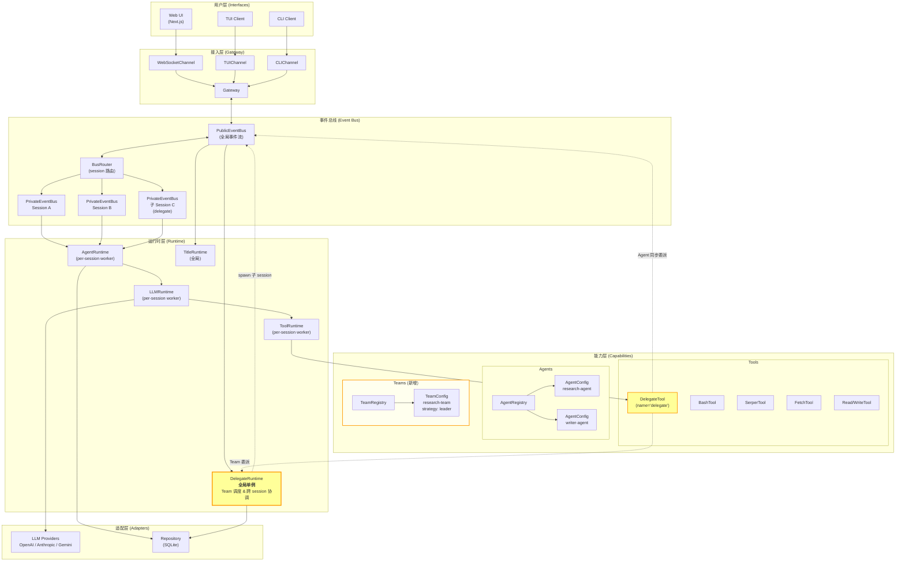
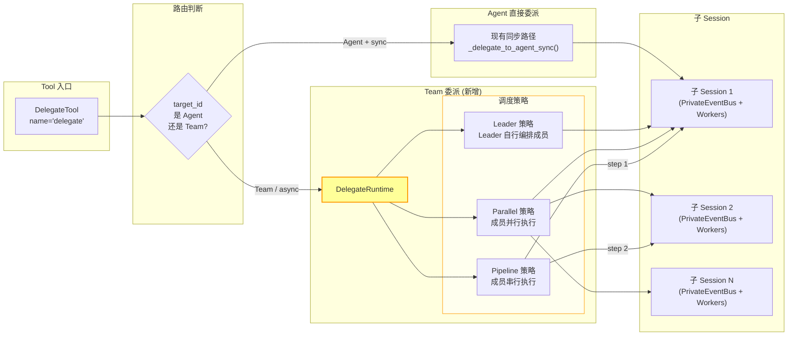
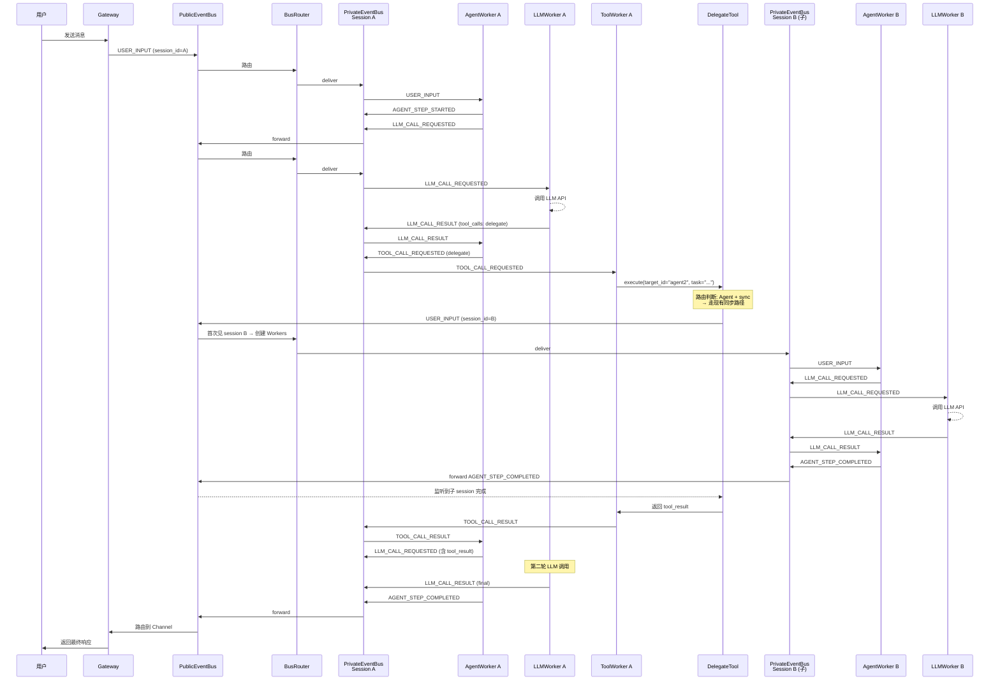
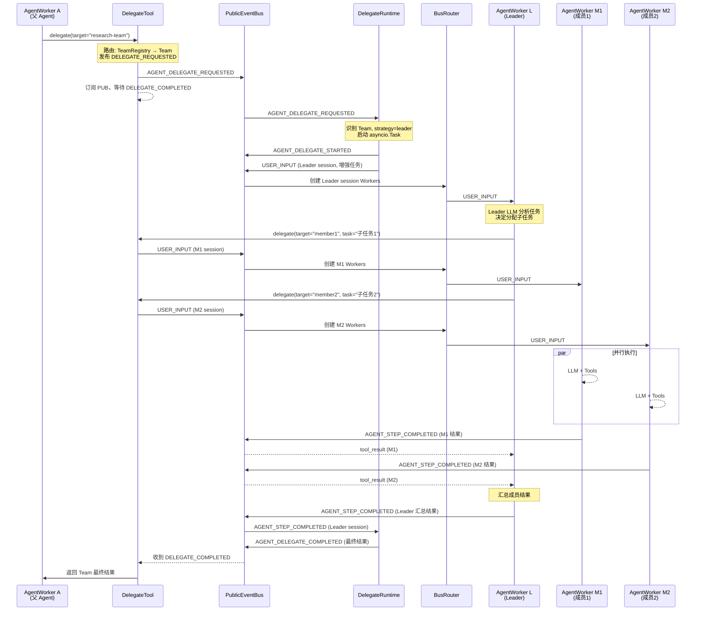
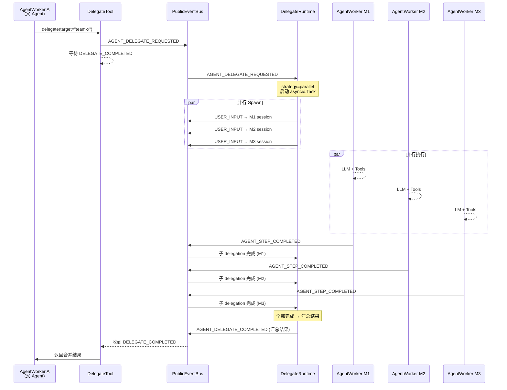
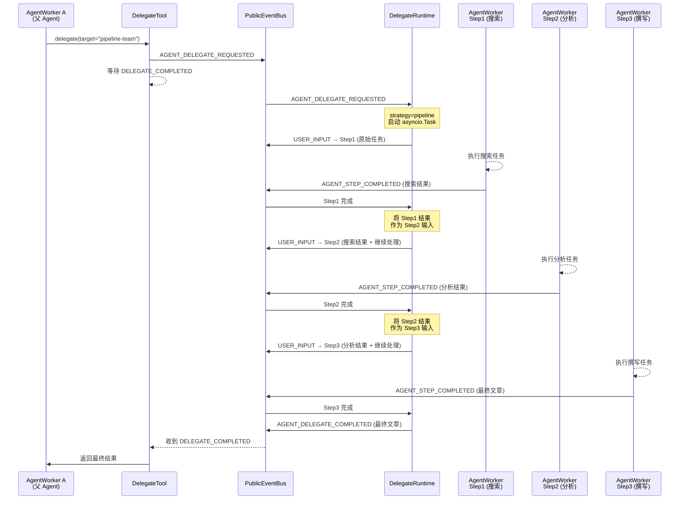
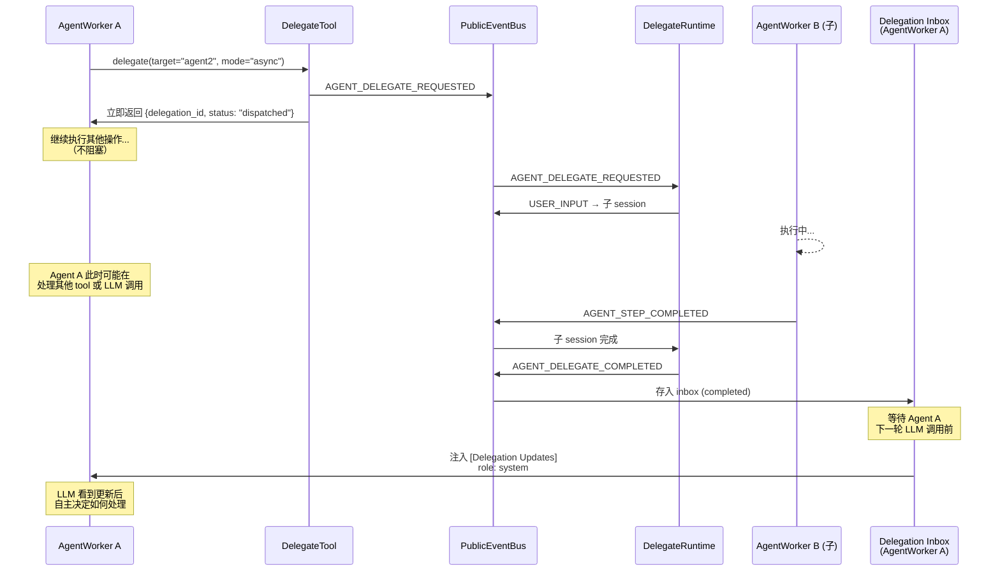
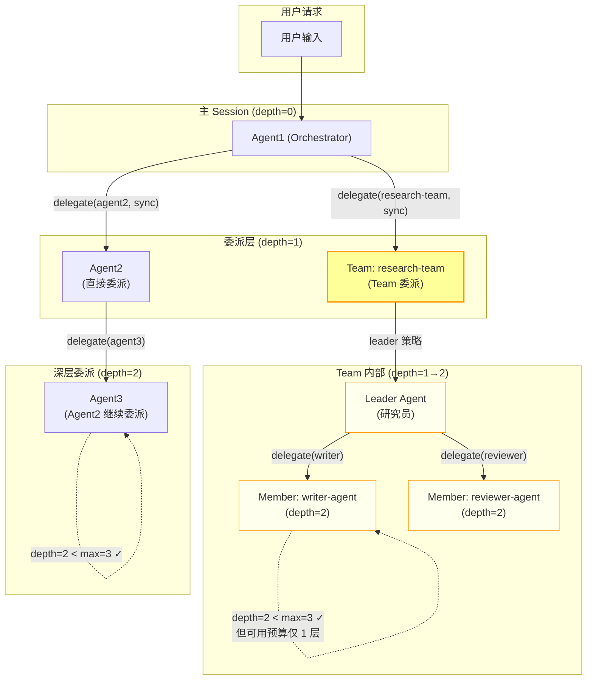

# Multi-Agent Team 架构图 & 信息流转图

## 1. 架构总览

## 2. 组件关系图

## 3. 信息流转 — 同步委派（Agent → Agent）

## 4. 信息流转 — Team 委派（Leader 策略）

## 5. 信息流转 — Team 委派（Parallel 策略）

## 6. 信息流转 — Team 委派（Pipeline 策略）

## 7. 异步委派信息流

## 8. 完整层次关系

