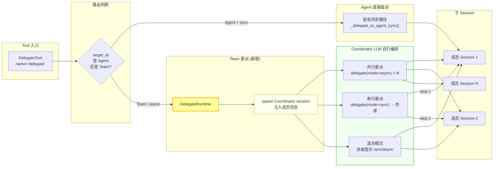
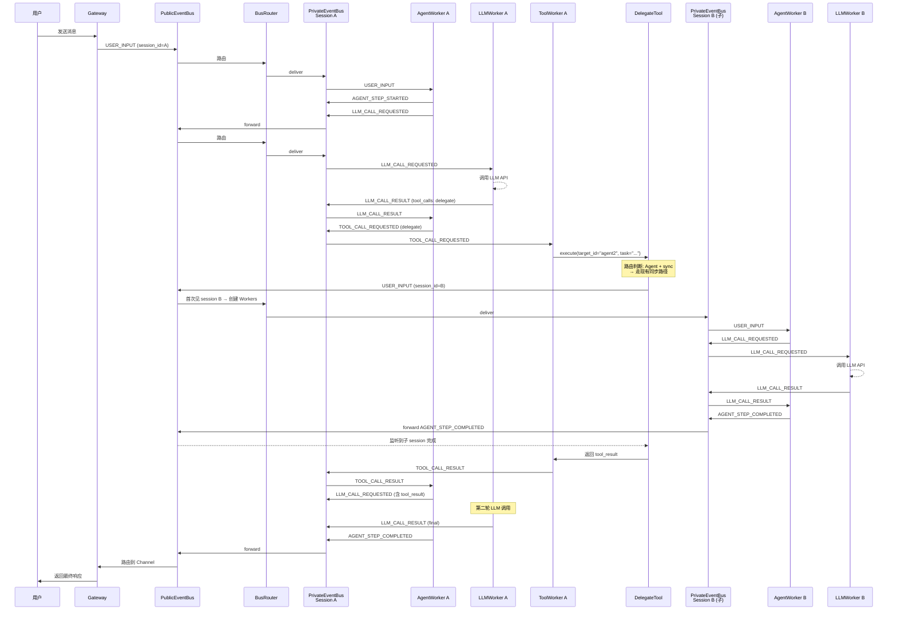
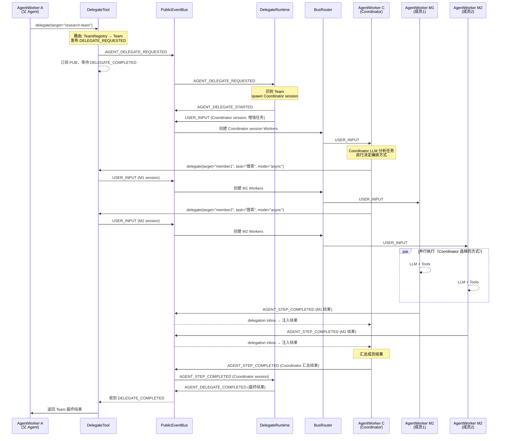
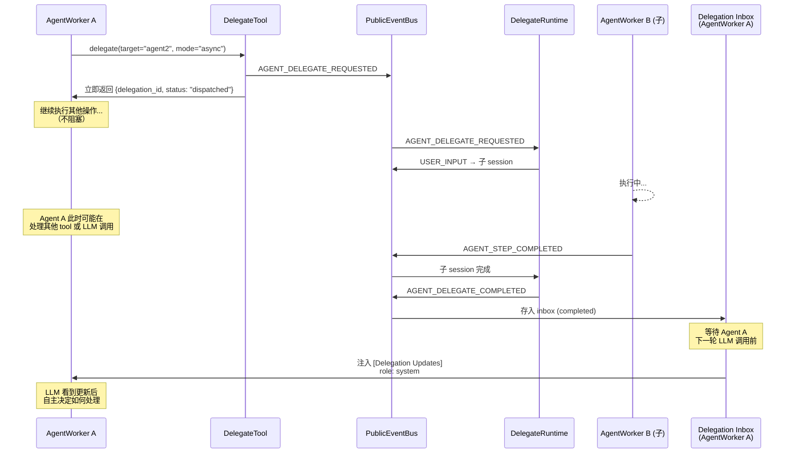
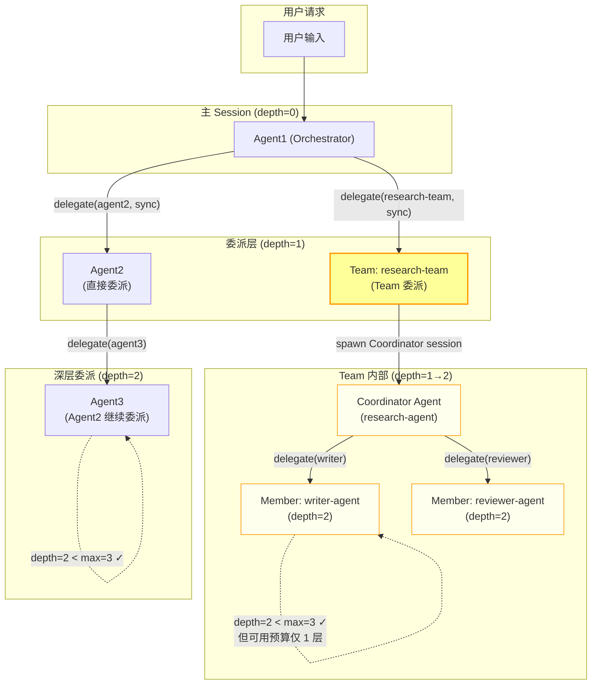

# Multi-Agent Team 架构图 & 信息流转图

## 1. 架构总览

```mermaid
graph TB

    subgraph 用户层
        WebUI["Web UI\n(Next.js)"]
        TUI["TUI Client"]
        CLI["CLI Client"]
    end

    subgraph 接入层
        GW["Gateway"]
        WSC["WebSocketChannel"]
        TUIC["TUIChannel"]
        CLIC["CLIChannel"]
    end

    subgraph 事件层
        PUB["PublicEventBus\n(全局事件流)"]
        BR["BusRouter\n(session 路由)"]
        PB1["PrivateEventBus\nSession A"]
        PB2["PrivateEventBus\nSession B"]
        PB3["PrivateEventBus\n子 Session C\n(delegate)"]
    end

    subgraph 运行时层
        AR["AgentRuntime\n(per-session worker)"]
        LR["LLMRuntime\n(per-session worker)"]
        TR["ToolRuntime\n(per-session worker)"]
        DR["DelegateRuntime\n全局单例\nTeam 调度 & 跨 session 协调"]
        TTR["TitleRuntime\n(全局)"]
    end

    subgraph 能力层

        subgraph Tools
            DT["DelegateTool\n(name='delegate')"]
            BT["BashTool"]
            ST["SerperTool"]
            FT["FetchTool"]
            RW["Read/WriteTool"]
        end

        subgraph Agents
            AREG["AgentRegistry"]
            AC1["AgentConfig\nresearch-agent"]
            AC2["AgentConfig\nwriter-agent"]
        end

        subgraph Teams
            TREG["TeamRegistry"]
            TC1["TeamConfig\nresearch-team\nstrategy: leader"]
        end

    end

    subgraph 适配层
        LLM["LLM Providers\nOpenAI / Anthropic / Gemini"]
        DB["Repository\n(SQLite)"]
    end

    WebUI --> WSC
    TUI --> TUIC
    CLI --> CLIC

    WSC --> GW
    TUIC --> GW
    CLIC --> GW

    GW <--> PUB

    PUB <--> BR
    BR --> PB1
    BR --> PB2
    BR --> PB3

    PB1 --> AR
    PB2 --> AR
    PB3 --> AR

    AR --> LR
    LR --> TR

    PUB --> DR
    PUB --> TTR

    TR --> DT

    DT -.->|Team 委派| DR
    DT -.->|Agent 同步委派| PUB
    DR -.->|spawn 子 session| PUB

    AREG --> AC1
    AREG --> AC2

    TREG --> TC1

    LR --> LLM
    AR --> DB
    DR --> DB

    style DR fill:#ff9,stroke:#f90,stroke-width:3px
    style Teams fill:#ffe,stroke:#f90,stroke-width:2px
    style DT fill:#ff9,stroke:#f90,stroke-width:2px
```

## 2. 组件关系图

```mermaid
graph LR
    subgraph 入口["Tool 入口"]
        DT["DelegateTool<br/>name='delegate'"]
    end

    subgraph 路由["路由判断"]
        R{"target_id<br/>是 Agent<br/>还是 Team?"}
    end

    subgraph Agent委派["Agent 直接委派"]
        AS["现有同步路径<br/>_delegate_to_agent_sync()"]
    end

    subgraph Team委派["Team 委派 (新增)"]
        DR["DelegateRuntime"]
        CO["spawn Coordinator session<br/>注入成员信息"]
    end

    subgraph Coordinator决策["Coordinator LLM 自行编排"]
        PA["并行委派<br/>delegate(mode=async) × N"]
        SE["串行委派<br/>delegate(mode=sync) → 传递"]
        MX["混合模式<br/>自由组合 sync/async"]
    end

    subgraph 子Session["子 Session"]
        CS1["成员 Session 1"]
        CS2["成员 Session 2"]
        CS3["成员 Session N"]
    end

    DT --> R
    R -->|"Agent + sync"| AS
    R -->|"Team / async"| DR
    AS --> CS1
    DR --> CO
    CO --> PA
    CO --> SE
    CO --> MX
    PA --> CS1
    PA --> CS2
    PA --> CS3
    SE -->|"step 1"| CS1
    SE -->|"step 2"| CS2
    MX --> CS1
    MX --> CS2

    style DR fill:#ff9,stroke:#f90,stroke-width:2px
    style CO fill:#ffe,stroke:#f90
    style Coordinator决策 fill:#f0fff0,stroke:#090
```

## 3. 信息流转 — 同步委派（Agent → Agent）

```mermaid
sequenceDiagram
    participant User as 用户
    participant GW as Gateway
    participant PUB as PublicEventBus
    participant BR as BusRouter
    participant PB_A as PrivateEventBus<br/>Session A
    participant AW_A as AgentWorker A
    participant LW_A as LLMWorker A
    participant TW_A as ToolWorker A
    participant DT as DelegateTool
    participant PB_B as PrivateEventBus<br/>Session B (子)
    participant AW_B as AgentWorker B
    participant LW_B as LLMWorker B

    User->>GW: 发送消息
    GW->>PUB: USER_INPUT (session_id=A)
    PUB->>BR: 路由
    BR->>PB_A: deliver
    PB_A->>AW_A: USER_INPUT
    AW_A->>PB_A: AGENT_STEP_STARTED
    AW_A->>PB_A: LLM_CALL_REQUESTED

    PB_A->>PUB: forward
    PUB->>BR: 路由
    BR->>PB_A: deliver
    PB_A->>LW_A: LLM_CALL_REQUESTED
    LW_A-->>LW_A: 调用 LLM API
    LW_A->>PB_A: LLM_CALL_RESULT (tool_calls: delegate)

    PB_A->>AW_A: LLM_CALL_RESULT
    AW_A->>PB_A: TOOL_CALL_REQUESTED (delegate)

    PB_A->>TW_A: TOOL_CALL_REQUESTED
    TW_A->>DT: execute(target_id="agent2", task="...")

    Note over DT: 路由判断: Agent + sync<br/>→ 走现有同步路径

    DT->>PUB: USER_INPUT (session_id=B)
    PUB->>BR: 首次见 session B → 创建 Workers
    BR->>PB_B: deliver
    PB_B->>AW_B: USER_INPUT

    AW_B->>PB_B: LLM_CALL_REQUESTED
    PB_B->>LW_B: LLM_CALL_REQUESTED
    LW_B-->>LW_B: 调用 LLM API
    LW_B->>PB_B: LLM_CALL_RESULT

    PB_B->>AW_B: LLM_CALL_RESULT
    AW_B->>PB_B: AGENT_STEP_COMPLETED

    PB_B->>PUB: forward AGENT_STEP_COMPLETED
    PUB-->>DT: 监听到子 session 完成

    DT->>TW_A: 返回 tool_result
    TW_A->>PB_A: TOOL_CALL_RESULT

    PB_A->>AW_A: TOOL_CALL_RESULT
    AW_A->>PB_A: LLM_CALL_REQUESTED (含 tool_result)
    Note over LW_A: 第二轮 LLM 调用

    LW_A->>PB_A: LLM_CALL_RESULT (final)
    AW_A->>PB_A: AGENT_STEP_COMPLETED

    PB_A->>PUB: forward
    PUB->>GW: 路由到 Channel
    GW->>User: 返回最终响应
```

## 4. 信息流转 — Team 委派（Coordinator 模式）

```mermaid
sequenceDiagram
    participant AW_A as AgentWorker A<br/>(父 Agent)
    participant DT as DelegateTool
    participant PUB as PublicEventBus
    participant DR as DelegateRuntime
    participant BR as BusRouter
    participant AW_C as AgentWorker C<br/>(Coordinator)
    participant AW_M1 as AgentWorker M1<br/>(成员1)
    participant AW_M2 as AgentWorker M2<br/>(成员2)

    AW_A->>DT: delegate(target="research-team")
    Note over DT: 路由: TeamRegistry → Team<br/>发布 DELEGATE_REQUESTED

    DT->>PUB: AGENT_DELEGATE_REQUESTED
    DT-->>DT: 订阅 PUB，等待 DELEGATE_COMPLETED

    PUB->>DR: AGENT_DELEGATE_REQUESTED
    Note over DR: 识别 Team<br/>spawn Coordinator session

    DR->>PUB: AGENT_DELEGATE_STARTED
    DR->>PUB: USER_INPUT (Coordinator session, 增强任务)
    PUB->>BR: 创建 Coordinator session Workers
    BR->>AW_C: USER_INPUT

    Note over AW_C: Coordinator LLM 分析任务<br/>自行决定编排方式

    AW_C->>DT: delegate(target="member1", task="搜索", mode="async")
    DT->>PUB: USER_INPUT (M1 session)
    PUB->>BR: 创建 M1 Workers
    BR->>AW_M1: USER_INPUT

    AW_C->>DT: delegate(target="member2", task="搜索", mode="async")
    DT->>PUB: USER_INPUT (M2 session)
    PUB->>BR: 创建 M2 Workers
    BR->>AW_M2: USER_INPUT

    par 并行执行（Coordinator 选择的方式）
        AW_M1-->>AW_M1: LLM + Tools
        AW_M2-->>AW_M2: LLM + Tools
    end

    AW_M1->>PUB: AGENT_STEP_COMPLETED (M1 结果)
    PUB-->>AW_C: delegation inbox → 注入结果

    AW_M2->>PUB: AGENT_STEP_COMPLETED (M2 结果)
    PUB-->>AW_C: delegation inbox → 注入结果

    Note over AW_C: 汇总成员结果

    AW_C->>PUB: AGENT_STEP_COMPLETED (Coordinator 汇总结果)

    PUB->>DR: AGENT_STEP_COMPLETED (Coordinator session)
    DR->>PUB: AGENT_DELEGATE_COMPLETED (最终结果)

    PUB-->>DT: 收到 DELEGATE_COMPLETED
    DT->>AW_A: 返回 Team 最终结果
```

## 5. 异步委派信息流

```mermaid
sequenceDiagram
    participant AW_A as AgentWorker A
    participant DT as DelegateTool
    participant PUB as PublicEventBus
    participant DR as DelegateRuntime
    participant AW_B as AgentWorker B (子)
    participant Inbox as Delegation Inbox<br/>(AgentWorker A)

    AW_A->>DT: delegate(target="agent2", mode="async")
    DT->>PUB: AGENT_DELEGATE_REQUESTED
    DT->>AW_A: 立即返回 {delegation_id, status: "dispatched"}

    Note over AW_A: 继续执行其他操作...<br/>（不阻塞）

    PUB->>DR: AGENT_DELEGATE_REQUESTED
    DR->>PUB: USER_INPUT → 子 session

    AW_B-->>AW_B: 执行中...

    Note over AW_A: Agent A 此时可能在<br/>处理其他 tool 或 LLM 调用

    AW_B->>PUB: AGENT_STEP_COMPLETED
    PUB->>DR: 子 session 完成
    DR->>PUB: AGENT_DELEGATE_COMPLETED

    PUB->>Inbox: 存入 inbox (completed)

    Note over Inbox: 等待 Agent A<br/>下一轮 LLM 调用前

    Inbox->>AW_A: 注入 [Delegation Updates]<br/>role: system

    Note over AW_A: LLM 看到更新后<br/>自主决定如何处理
```

## 6. 完整层次关系

```mermaid
graph TD
    subgraph 用户请求
        U["用户输入"]
    end

    subgraph 主Session["主 Session (depth=0)"]
        A1["Agent1 (Orchestrator)"]
    end

    subgraph 委派层1["委派层 (depth=1)"]
        A2["Agent2<br/>(直接委派)"]
        T1["Team: research-team<br/>(Team 委派)"]
    end

    subgraph Team内部["Team 内部 (depth=1→2)"]
        Coord["Coordinator Agent<br/>(research-agent)"]
        M1["Member: writer-agent<br/>(depth=2)"]
        M2["Member: reviewer-agent<br/>(depth=2)"]
    end

    subgraph 深层委派["深层委派 (depth=2)"]
        A3["Agent3<br/>(Agent2 继续委派)"]
    end

    U --> A1
    A1 -->|"delegate(agent2, sync)"| A2
    A1 -->|"delegate(research-team, sync)"| T1
    T1 -->|"spawn Coordinator session"| Coord
    Coord -->|"delegate(writer)"| M1
    Coord -->|"delegate(reviewer)"| M2
    A2 -->|"delegate(agent3)"| A3

    A3 -.->|"depth=2 < max=3 ✓"| A3
    M1 -.->|"depth=2 < max=3 ✓<br/>但可用预算仅 1 层"| M1

    style T1 fill:#ff9,stroke:#f90,stroke-width:2px
    style Coord fill:#ffe,stroke:#f90
    style M1 fill:#ffe,stroke:#f90
    style M2 fill:#ffe,stroke:#f90
```
