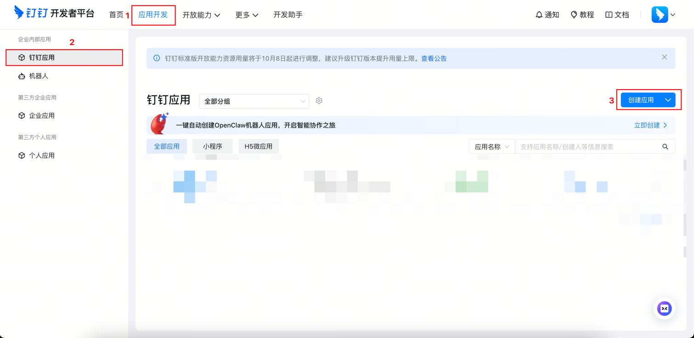
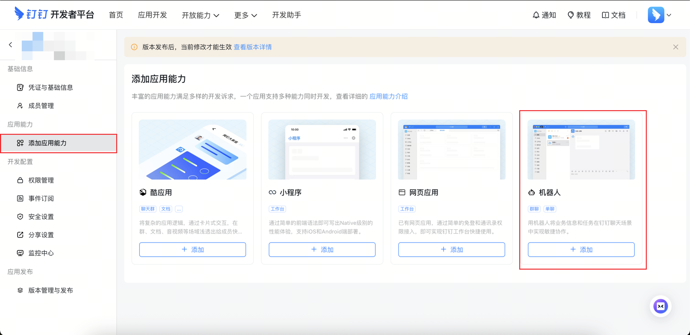
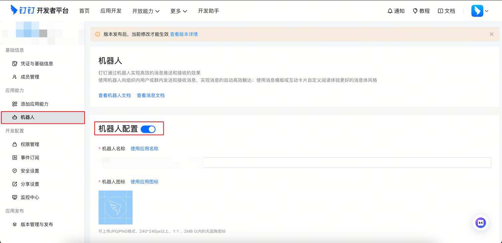
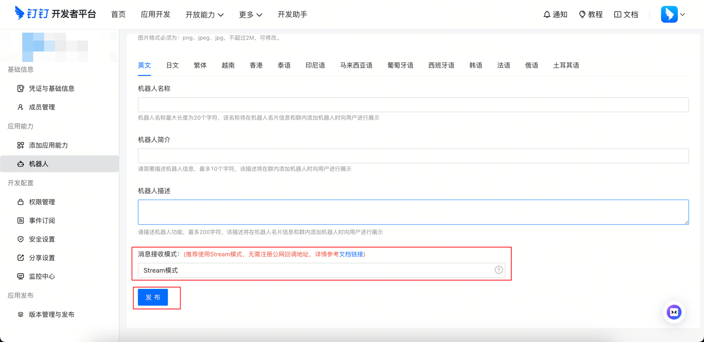
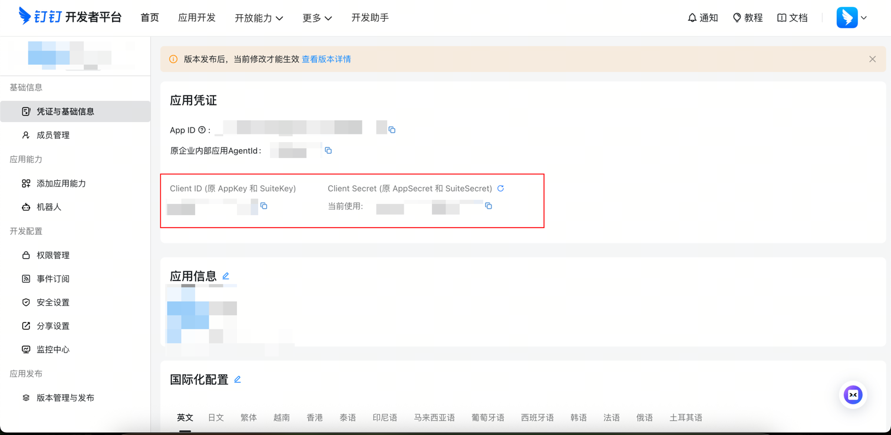

# 怎么创建钉钉机器人

## 1. 创建应用
- 打开[钉钉开发者平台](https://open-dev.dingtalk.com/)
- 点击`应用开发` 
- 选择`企业内部应用`下的`钉钉应用`
- 点击`创建应用`，填写应用名称和描述

## 2. 配置机器人权限
- `添加应用能力` - 添加`机器人`

- 在侧边栏选择`机器人`
- 开启`机器人配置`
- 
- 拉到最底下，`消息接收模式`选择`Stream模式`
- 点击`发布`

- 配置权限  
在 权限管理 页面，搜索并添加以下三个必要权限：
  - `Card.Streaming.Write`: 向 AI Card 推送流式内容（打字机效果必需）
  - `Card.Instance.Write`: 创建和更新 AI Card 实例
  - `qyapi_robot_sendmsg`: 机器人发送消息

## 3. 发布应用
- 在 `版本管理与发布` 页面点击 `创建新版本`
- 填写版本说明后提交
- 选择应用可见范围（建议先设为 全员 进行测试）
- 点击 `保存`
- 点击 `确认发布`

## 4. 获取 `client_id` & `client_secret`
- 应用侧边栏选择 `凭证与基础信息`

