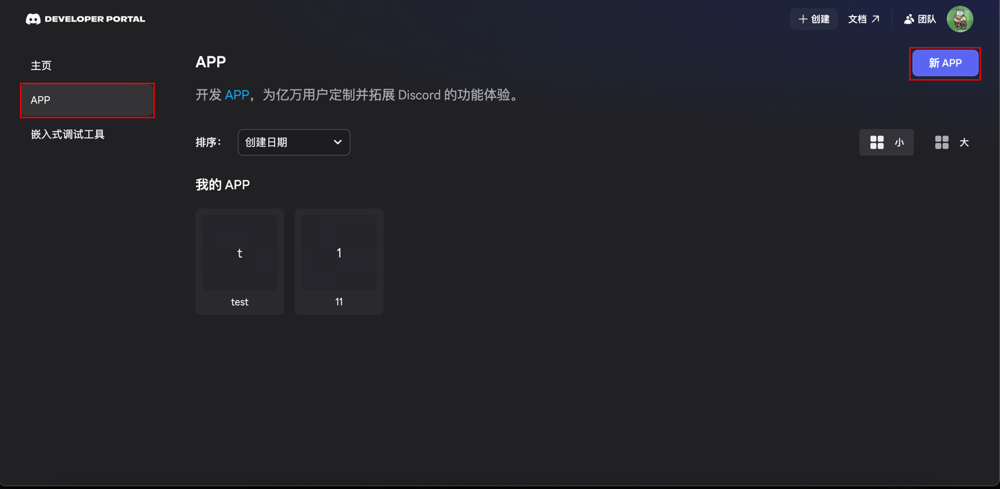
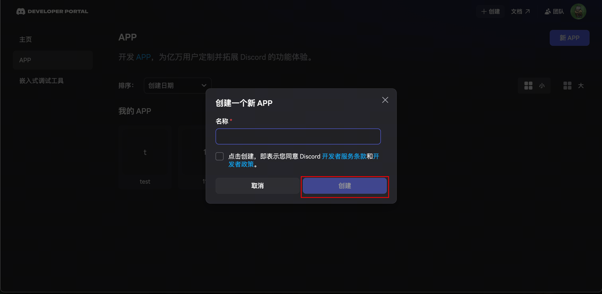
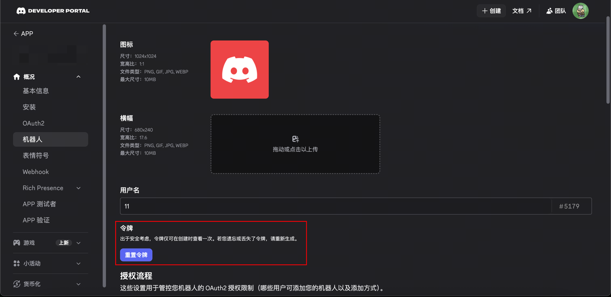
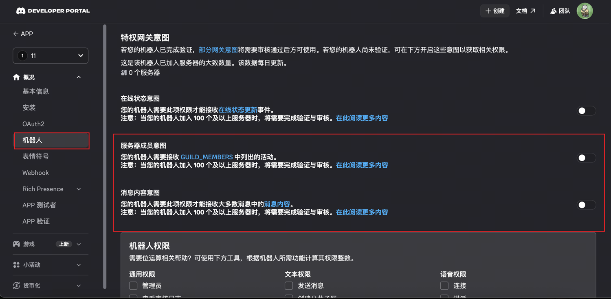
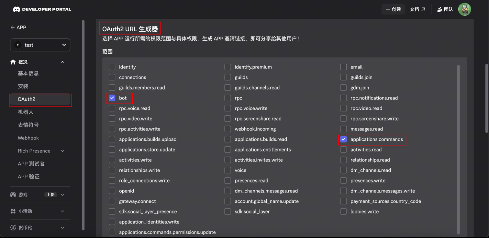
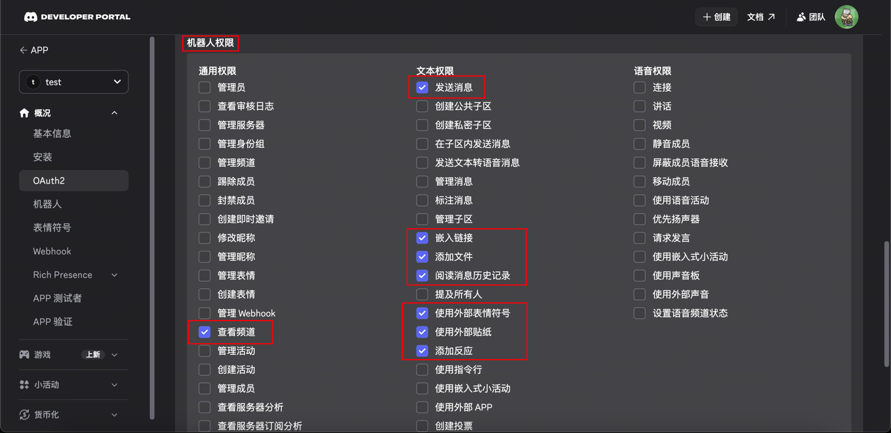
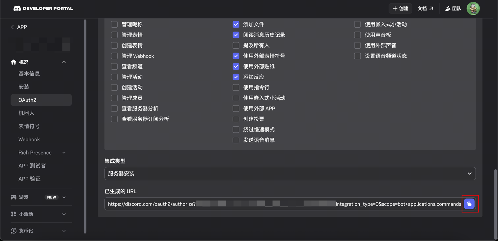

# 如何创建Discord Bot

## 1.创建 Discord 应用 + 机器人用户
[Discord 开发者门户](https://discord.com/developers/) 
→ Applications([直达链接](https://discord.com/developers/applications)) 
→ New Application -> 创建  

在你刚创建的应用中点击`Bot`, 复制 Bot Token

## 2. 启用网关意图

Discord 会阻止”特权意图”，除非你明确启用它们。

在 Bot → Privileged Gateway Intents 中启用：  

Message Content Intent（在大多数服务器中读取消息文本所必需；没有它你会看到”Used disallowed intents”或机器人会连接但不响应消息）

Server Members Intent（推荐；服务器中的某些成员/用户查找和允许列表匹配需要）

你通常不需要 Presence Intent。

## 3. 生成邀请 URL（OAuth2 URL Generator）
在你的应用中：OAuth2 → URL Generator Scopes  
- bot  
- applications.commands（原生命令所需）

Bot Permissions（最小基线）  
- View Channels  
- Send Messages  
- Read Message History  
- Embed Links  
- Attach Files  
- Add Reactions（可选但推荐）  
- Use External Emojis / Stickers（可选；仅当你需要时）  

除非你在调试并完全信任机器人，否则避免使用 Administrator。

复制生成的 URL，打开它，选择你的服务器，然后安装机器人。

