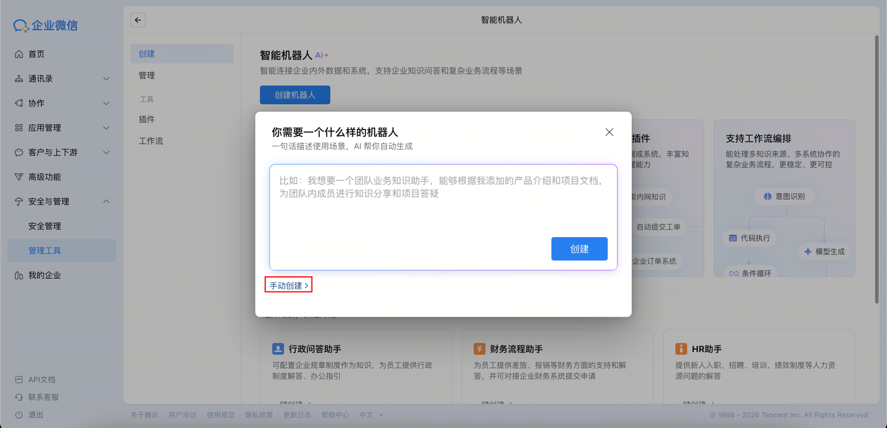
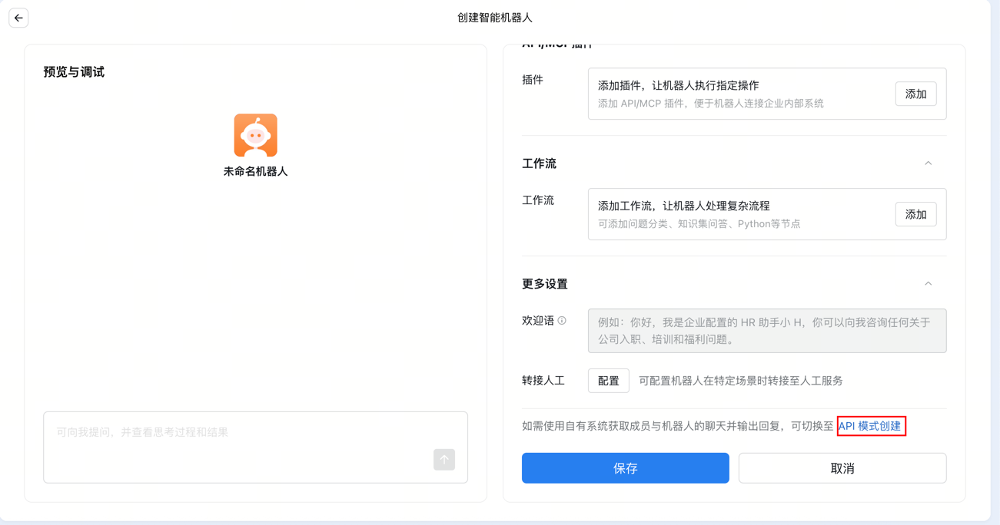
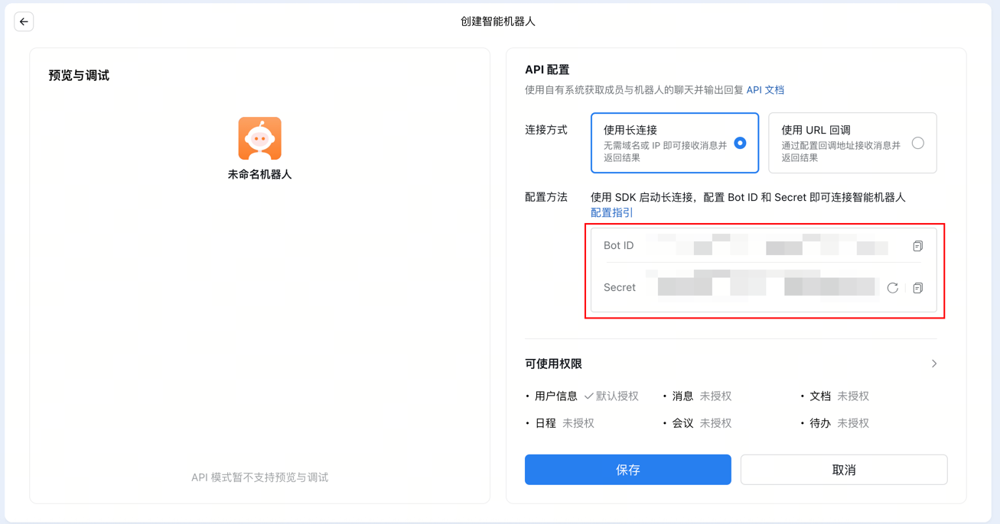

# 创建企业微信智能机器人

### 1. 打开创建入口

1. 登陆[企微工作台](https://work.weixin.qq.com/)

2. 选择: 安全与管理 - 管理工具 - 智能机器人 - 创建机器人  
[直达链接](https://work.weixin.qq.com/wework_admin/frame#/aiHelper/list?tab=create)
3. 手动创建

4. API模式创建(右边拉到最下面)

### 2. 选择长连接模式并获取凭证

选择以 **长连接** 方式创建机器人。通过长连接方式创建的智能机器人，支持主动向用户发送消息。

创建完成后，记录以下凭证：

- **Bot ID**：机器人唯一标识
- **Secret**：机器人密钥

❗ **重要**：请妥善保管 Secret，不要分享给他人。

> 最后按`保存`创建bot
---
