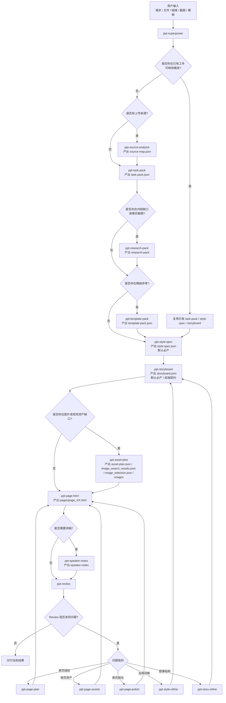

# PPT Skills 重构设计

## 1. 目标与约束

本次迭代只重构 `.sensenova-claw/skills` 中的 PPT 技能体系，不修改 Sensenova-Claw 运行时代码。

目标如下：

1. 将旧的“大一统 `pptx` skill”重构为新的 `ppt-*` superpower 体系。
2. 默认采用“快速优先”路径，避免生成一套 PPT 时出现过长流程。
3. 同时保留 `B + C` 级别的中断、介入和继续推进能力：
   - `B`：关键工件级可独立生成、替换、重跑。
   - `C`：页面级、图片槽位级可按需单独修复。
4. `style-spec.json` 必须为默认必产工件，用于稳定设计一致性和设计丰富度。
5. `storyboard.json` 必须为默认必产工件，并提供固定 schema，供前端阶段性展示和局部修改。
6. 讲稿能力纳入体系，但当前版本作为可选交付物。

当前稳定交付物仍是 HTML slides，而不是 `.pptx` 文件。未来若要支持 `.pptx` 导出，应增加独立 skill，而不是重新把总控 skill 做大。

---

## 2. 旧体系问题分析

旧体系已经覆盖了若干有效能力：信息收集、风格提取、大纲生成、图片选择、HTML 生成。但主要问题不在单点能力，而在编排方式。

### 2.1 总控 skill 过重

旧 `pptx` 同时承担了：

- 任务理解
- 信息规划
- brief 汇总
- 风格抽取调度
- 大纲调度
- 图片调度
- HTML 调度
- 阶段闸门与结果说明

职责边界过大，导致：

- 中途打断后难以恢复
- 局部返工时只能“再跑一次整套”
- 很难把阶段性结果稳定展示给前端

### 2.2 前后阶段只停留在文档层

旧设计文档里已经描述了：

- 输入汇总
- 内容完整性判断
- 后续流程规划
- 文档解析
- 模板拆解
- 页面检查
- 模板/偏好沉淀

但这些阶段没有真正成为可独立调用的 skill，导致“设计文档中的流程”和“实际 skills 能做的事”之间存在断层。

### 2.3 上传文件的职责混杂

用户上传的输入至少有三种生态位：

- 内容素材
- 风格参考
- 模板参考

旧体系没有把这三类职责显式拆开。结果是：

- 后续 `style`、`outline`、`html` 都在消费混杂输入
- 同一个文件的“内容价值”和“设计价值”没有被分别利用
- 很难决定某个文件应该驱动哪条后续链路

### 2.4 `style` 不是中心工件

旧体系中 `ppt-style-extract` 是一个子阶段，但不是整个系统的设计控制面。

这会带来两个直接问题：

1. 页面之间的风格一致性不稳定，容易退化成模型“临场发挥的一致性”。
2. 如果不提前建立设计共识，模型会优先保内容正确，最终页面就会走向单一、保守、简陋。

### 2.5 `outline` 不足以承担前端契约

旧 `outline` 更像内部生成产物，不是前端阶段展示的稳定对象。它缺少：

- 固定 schema 版本
- 页面叙事角色
- 观众收获点
- 局部未解决项
- 讲述意图

因此它很难同时承担：

- 前端大纲展示
- 用户局部修改
- 后续页面生成输入
- 局部返工锚点

### 2.6 流程默认串行到底

旧体系默认以“从输入一路跑到 HTML”组织，适合一次性批处理，不适合：

- 用户先看阶段成果再决定是否继续
- 用户只改第 3 页
- 用户只替换某个图片槽位
- 图片阶段局部失败，但其他页面仍可先推进

---

## 3. 新体系的设计原则

### 3.1 统一入口，分层执行

新体系只保留一个默认入口 `ppt-superpower`，负责：

- 判断当前任务类型
- 判断已有工件是否可复用
- 决定运行模式
- 决定下一步最值得生成的工件

### 3.2 围绕工件组织，而不是围绕抽象步骤组织

新的核心思路是“工件优先”。

用户中断、前端展示、局部返工、继续推进，都应该围绕以下对象展开：

- `task-pack.json`
- `style-spec.json`
- `storyboard.json`
- `asset-plan.json`
- `speaker-notes.json`
- `pages/page_XX.html`

### 3.3 默认短路径，按需下钻

默认路径只生成最关键的工件，不把所有输入都解析到最细。

只有命中触发器时，才下钻到：

- 页面级
- 图片槽位级
- 风格局部增强
- 叙事局部修正

### 3.4 `style-spec` 是设计控制面

`style-spec.json` 不是附属文件，而是全 deck 的设计控制面。它必须解决：

- 每页为何属于同一套 deck
- 页面类型如何变化但不失统一
- 如何避免“能用但丑”的安全产出

### 3.5 `storyboard` 是前端契约

`storyboard.json` 是默认必产，并承担双重职责：

- 页面叙事和页面生成的控制面
- 前端阶段展示和局部编辑的稳定契约

### 3.6 上传文件必须先分类

只要有文件、链接、截图、模板输入，就应先做 `ppt-source-analysis`，把来源拆成：

- `content_source`
- `style_reference`
- `template_reference`
- `mixed_source`

这样后续每个 skill 才知道自己该消费哪部分输入。

### 3.7 结果必须落在自包含 deck 目录

新体系不能把中间结果直接散落在 agent 根目录或当前工作目录顶层。

总规则：

- 优先使用用户明确指定的输出目录
- 如果是在已有 deck 上继续修改，复用原有目录
- 否则自动创建新的 `deck_dir`
- `deck_dir` 名称使用 `query概述 + 时间戳`
- `deck_dir` 是本轮任务的 canonical 输出根目录
- 后续 skill 只能直接复制这个值，不要手写、缩写、翻译或重拼目录名
- 创建 `deck_dir` 后立即创建 `pages/` 与 `images/`

所有工件都必须落在同一个 `deck_dir` 中，例如：

- `task-pack.json`
- `style-spec.json`
- `storyboard.json`
- `asset-plan.json`
- `image_search_results.json`
- `image_selection.json`
- `pages/page_XX.html`
- `images/...`
- `review.md`

---

## 4. 新 Skill 体系

### 4.1 顶层总控

#### `ppt-superpower`

唯一默认入口。

负责：

- 先确定或复用本次任务的 `deck_dir`
- 识别任务类型：新建整套、继续已有成果、局部修改、只产出中间工件
- 决定运行模式：`fast / guided / surgical`
- 决定下一步生成哪个工件
- 判断哪些已有工件可复用

### 4.2 关键工件 skills

#### `ppt-source-analysis`

负责输入来源分类，产出 `source-map.json`。

#### `ppt-task-pack`

负责统一记录任务目标、页数、受众、语言、限制、交付物、输出目录和推荐路径，产出 `task-pack.json`。

#### `ppt-research-pack`

负责内容研究和内容补充，产出 `research-pack.md` 或 `research-pack.json`。

#### `ppt-template-pack`

负责模板拆解和模板约束提取，产出 `template-pack.json`。

#### `ppt-style-spec`

负责 deck 级设计语言，产出 `style-spec.json`。默认必产。

#### `ppt-storyboard`

负责分页叙事和前端契约，产出 `storyboard.json`。默认必产。

#### `ppt-asset-plan`

负责图片与视觉资产规划，产出 `asset-plan.json`，必要时同时落地 `image_search_results.json`、`image_selection.json` 和 `images/`，并在下载前先创建 `deck_dir/images`。

#### `ppt-page-html`

负责按页生成 `pages/page_XX.html`。
每个 `storyboard.json.pages[n]` 都必须对应一个单独的页面文件，不允许把整套 deck 拼成单个 HTML，同时必须忠实消费 `style-spec.json` 和已经下载成功的本地图片，并继续遵守 `1280x720` 固定画布、16:9 比例和页脚安全区约束。
在生成前，消费前必须先确认 `task-pack.json`、`style-spec.json`、`storyboard.json` 以及相关 `asset-plan.json` 真实存在且可读；如果目标文件不存在、目录不一致或关键字段缺失，先补齐依赖，不要猜测。

#### `ppt-speaker-notes`

负责生成逐页讲稿，产出 `speaker-notes.json` 或 `speaker-notes.md`。当前为可选交付物。

#### `ppt-review`

负责整套结果审查，产出 `review.md` 或 `review.json`。

### 4.3 局部修复 skills

这些 skill 不进入默认快路径，只有触发器命中时才使用：

- `ppt-page-plan`
- `ppt-page-assets`
- `ppt-page-polish`
- `ppt-style-refine`
- `ppt-story-refine`

### 4.4 新方案流程图

下面这张流程图描述了新体系的完整推进方式：默认先走 `fast` 快路径，只在命中触发器时插入研究、模板、资产、讲稿或局部修复链路。



---

## 5. 核心工件模型

### 5.1 必产工件

默认必产：

- `task-pack.json`
- `style-spec.json`
- `storyboard.json`

原因：

- `task-pack` 提供统一任务边界
- `style-spec` 提供统一设计语言
- `storyboard` 提供统一叙事与前端契约
- 三者共同固定 `deck_dir`、设计控制面和页面控制面，保证 deck 可继续演进

### 5.2 可选工件

按需产出：

- `source-map.json`
- `research-pack.md` / `research-pack.json`
- `template-pack.json`
- `asset-plan.json`
- `image_search_results.json`
- `image_selection.json`
- `speaker-notes.json` / `speaker-notes.md`
- `review.md` / `review.json`

### 5.3 `task-pack.json`

建议最小结构：

```python
from typing import Literal

Mode = Literal["fast", "guided", "surgical"]
OutputPolicy = Literal["user-provided", "reuse-existing", "auto-generated"]

class TaskPack:
    schema_version: str
    topic: str
    language: str
    audience: str
    goal: str
    total_pages: int
    mode: Mode
    deliverables: list[str]
    must_have_sections: list[str]
    constraints: list[str]
    known_gaps: list[str]
    available_sources: list[str]
    deck_dir: str
    output_policy: OutputPolicy
```

要求：

- `deck_dir` 必须被显式记录，并作为后续 skill 的统一输出目录
- 它是唯一可信的 canonical 输出根目录
- 后续 skill 只能直接复制这个值，不要手写、缩写、翻译或重拼目录名
- 如果用户未指定目录，`deck_dir` 使用 `query概述 + 时间戳` 自动创建
- 不允许把工件散落写到 agent 根目录

### 5.4 `style-spec.json`

建议最小结构：

```python
class StyleSpec:
    schema_version: str
    design_theme: str
    design_keywords: list[str]
    color_roles: list["ColorRole"]
    typography: "TypographySpec"
    page_type_principles: list["PageTypePrinciple"]
    component_tone: list[str]
    diversity_rules: list[str]
    anti_patterns: list[str]


class ColorRole:
    role: str
    hex: str
    usage: str


class TypographySpec:
    title_font: str
    body_font: str
    title_weight: str
    body_line_height: float


class PageTypePrinciple:
    page_type: str
    visual_goal: str
    allowed_variants: list[str]
```

要求：

- `style-spec.json` 为默认必产
- 它是设计控制面
- 必须先读取 `task-pack.json`
- 输出路径必须严格为 `${deck_dir}/style-spec.json`
- 不要手写、缩写、翻译或重拼目录名
- 必须包含“页面类型视觉原则”
- 必须包含“禁用项”或等价反模式
- 后续 `ppt-storyboard` 与 `ppt-page-html` 必须显式消费它

### 5.5 `storyboard.json`

`storyboard.json` 是默认必产，同时也是前端契约工件。

建议固定 schema：

```python
from typing import Literal

Mode = Literal["fast", "guided", "surgical"]

class Storyboard:
    schema_version: str
    ppt_title: str
    language: str
    total_pages: int
    mode: Mode
    pages: list["StoryboardPage"]


class StoryboardPage:
    page_id: str
    page_number: int
    title: str
    page_type: str
    section: str
    narrative_role: str
    audience_takeaway: str
    layout_intent: str
    style_variant: str
    content_blocks: list["ContentBlock"]
    visual_requirements: list[str]
    data_requirements: list[str]
    asset_requirements: list[str]
    unresolved_issues: list[str]
    presenter_intent: str


class ContentBlock:
    block_id: str
    heading: str
    summary: str
    evidence_refs: list[str]
```

设计要求：

- 消费前必须先确认依赖文件真实存在且可读
- 如果目标文件不存在、路径不一致或关键字段缺失，先补齐依赖，不要猜测
- 页数必须与 `task-pack.json` 对齐
- 内容语言必须默认与用户 query 保持一致
- 允许前端稳定渲染页面列表
- 允许后续 skill 基于 `page_id` 做局部重写
- `presenter_intent` 只提供轻量讲述意图，不承担完整讲稿职责

### 5.6 `asset-plan.json`

建议最小结构：

```python
class AssetPlan:
    schema_version: str
    deck_dir: str
    slots: list["AssetSlot"]


class AssetSlot:
    page_id: str
    page_title: str
    slot_id: str
    purpose: str
    source_caption: str
    query: str
    selected: bool
    selected_image: "SelectedImage | None"
    rejected_candidates: list["RejectedCandidate"]
    status: str
    reason: str


class SelectedImage:
    title: str
    image_url: str
    local_path: str
    source_page: str
    source_domain: str


class RejectedCandidate:
    image_url: str
    rejection_stage: str
    reason: str
```

要求：

- 消费前必须先确认依赖文件真实存在且可读
- 如果目标文件不存在、路径不一致或关键字段缺失，先补齐依赖，不要猜测
- 必须保留 `image_search_results.json`，记录 query 与原始候选
- 必须保留 `image_selection.json`，记录最终选择与拒绝原因
- 选图流程必须可审计，不能让“筛选过程”在重构后消失
- 必须先下载验证，再做最终选择
- 优先落地本地图片
- 本地文件不存在时必须显式标记 `unresolved`
- 最终选中的图片必须来自下载成功的本地文件
- 不允许把远程 URL 伪装成最终本地资产

### 5.7 `speaker-notes.json`

讲稿是可选交付物。

建议结构：

```python
class SpeakerNotes:
    schema_version: str
    language: str
    notes: list["SpeakerNotePage"]


class SpeakerNotePage:
    page_id: str
    page_title: str
    opening: str
    key_points: list[str]
    transition: str
    caution: list[str]
```

---

## 6. 默认运行路径

### 6.1 快速优先

无上传文件时的最小路径：

1. `ppt-task-pack`
2. `ppt-style-spec`
3. `ppt-storyboard`
4. `ppt-page-html`
5. `ppt-review`

有上传文件时的常规路径：

1. `ppt-source-analysis`
2. `ppt-task-pack`
3. `ppt-style-spec`
4. `ppt-storyboard`
5. `ppt-page-html`
6. `ppt-review`

### 6.2 按需插入

仅在命中触发器时插入：

- `ppt-research-pack`
- `ppt-template-pack`
- `ppt-asset-plan`
- `ppt-speaker-notes`

### 6.3 运行模式

#### `fast`

默认模式。

- 只生成必要工件
- 优先尽快得到整套结果
- 只在必要时下钻

#### `guided`

用于希望逐步查看中间产物的场景。

- 如果用户说“先看大纲”“先确认大纲”“先看风格和大纲”或“确认后再生成”，必须进入 `guided`
- 在用户确认前，不要直接生成 `pages/page_XX.html`
- 不要只返回一段自由文本大纲，应展示已落盘的结构化工件

- 更稳定地产出中间工件
- 更适合前端阶段性确认

#### `surgical`

用于局部修复。

- 不重跑整套
- 只改指定页面、指定槽位、指定风格或叙事局部

---

## 7. 上传文件分析策略

`ppt-source-analysis` 必须先做来源分类。

### 7.1 内容素材

如报告、文档、网页、说明材料。

作用：

- 提供事实、论点、章节信息
- 进入 `ppt-research-pack`

### 7.2 风格参考

如参考 PPT、设计图、截图、海报。

作用：

- 提供配色、气质、排版语气
- 进入 `ppt-style-spec`

### 7.3 模板参考

如已有 deck、页面样例、版式模板。

作用：

- 提供结构、布局、组件约束
- 进入 `ppt-template-pack`

### 7.4 混合来源

同一个文件可能同时具备：

- 内容价值
- 风格价值
- 模板价值

因此 `source-map.json` 必须允许 `mixed_source`，而不是强制一对一归类。

---

## 8. 讲稿策略

讲稿能力保留，但当前版本作为可选交付物。

### 8.1 为什么不直接塞进 `storyboard`

如果把完整讲稿直接写入 `storyboard.json`，会带来三个问题：

1. 前端契约会变重
2. 页面结构一改，讲稿也会跟着整份重写
3. `storyboard` 会从控制面膨胀成内容大容器

### 8.2 当前策略

- `storyboard.json` 只保留 `presenter_intent`
- 完整讲稿由 `ppt-speaker-notes` 生成

### 8.3 默认触发条件

只有以下情况才默认生成讲稿：

- 用户明确要求讲稿
- 场景是汇报、路演、培训、答辩、演讲
- `task-pack.json` 把讲稿列为交付物

---

## 9. 触发器设计

### 9.1 任务级触发器

- 用户目标不清晰
- 存在上传文件、链接、模板、截图
- 内容不足，需要补充研究
- 主题涉及真实事实
- 用户明确要求先看中间工件

### 9.2 页面级触发器

- 用户只改某一页
- review 发现某页结构失衡
- 某页内容溢出或过空
- 某页风格漂移
- 某页页面类型不合适

### 9.3 槽位级触发器

- 某个图片槽位未解决
- 某个图片槽位下载失败
- 用户只想替换 hero 图或背景图

---

## 10. 与旧能力的关系

新体系不保留旧 skill 名称，也不做薄封装转发。

但需要继承旧体系中已经验证有效的限制与经验：

- 页面默认语言与用户 query 保持一致
- 页面生成使用 `1280x720` 画布
- 图片优先本地化，不直接依赖远程链接
- 图片检索必须保留候选、筛选理由和下载记录
- 图片选择阶段必须记录 unresolved 状态
- 创建 `deck_dir` 后应立即创建 `pages/` 与 `images/`
- HTML 页面必须保留页脚安全区
- HTML 页面应保持严格的 16:9 / `1280x720` 画布
- 右下角 `160px x 60px` 必须保留给页码
- HTML 不应因为重构而退回通用默认样式
- 叙事结构应与目标页数保持一致
- 风格应区分 deck 级规则与页面局部装饰

---

## 11. 测试与评测用例

### 11.1 契约测试

本次重构至少要有以下契约测试：

1. 新 `ppt-*` skill 集合存在
2. 旧 `ppt-image-selection / ppt-html-gen` 可以保留作参考文档，但 `ppt-superpower` 不得回退调用它们
3. `ppt-superpower` 明确声明 `fast / guided / surgical` 与 `deck_dir`，并要求初始化 `pages/` / `images/`
4. `ppt-style-spec` 明确声明默认必产、设计控制面、页面类型视觉原则、禁用项
5. `ppt-storyboard` 明确包含固定 schema 字段
6. `ppt-asset-plan` 明确保留搜图候选、筛选记录、本地下载结果，并在下载前先创建 `deck_dir/images`
7. `ppt-page-html` 明确消费 `style-spec.json` 与本地图片，不退回通用默认样式，同时恢复严格的 `1280x720` / 页脚安全区约束
8. `ppt-speaker-notes` 明确标注可选交付物
9. 设计文档中的术语与新 skill 体系一致

### 11.2 场景测试矩阵

#### 用例 1：无上传文件，简单中文主题

期望：

- 走 `fast`
- 生成 `task-pack.json`
- 生成 `style-spec.json`
- 生成 `storyboard.json`

#### 用例 2：上传报告作为内容素材

期望：

- 在 `source-map.json` 中识别为 `content_source`
- 进入 `ppt-research-pack`

#### 用例 3：上传参考图作为风格参考

期望：

- 识别为 `style_reference`
- `style-spec.json` 不再只是保守空壳

#### 用例 4：上传模板 deck

期望：

- 识别为 `template_reference`
- 进入 `ppt-template-pack`

#### 用例 5：同一文件同时承担内容和风格作用

期望：

- 识别为 `mixed_source`

#### 用例 6：用户只要求先看风格和大纲

期望：

- 流程停在 `style-spec.json` 与 `storyboard.json`
- 必须进入 `guided`
- 不要直接生成 `pages/page_XX.html`
- 不要只返回一段自由文本大纲

#### 用例 7：前端阶段性展示

期望：

- `storyboard.json` 可稳定渲染页面列表、块摘要和未解决项

#### 用例 8：用户只改第 3 页

期望：

- 进入 `surgical`
- 只触发页面级 skill

#### 用例 9：某个图片槽位下载失败

期望：

- 只标记该槽位 unresolved
- 其他页面继续生成

#### 用例 10：用户要求讲稿

期望：

- 生成 `speaker-notes.json` 或 `speaker-notes.md`
- 不污染 `storyboard.json` 的前端契约

---

## 12. 实施范围

本轮实施范围：

- 重写 `docs/ppt-skills/design.md`
- 全量替换 `.sensenova-claw/skills` 下当前 PPT skills
- 新增契约测试，验证新体系边界

本轮不做：

- Sensenova-Claw 运行时代码改造
- 新的 `.pptx` 导出实现
- 前端渲染逻辑改造
